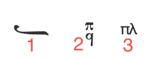
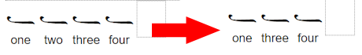
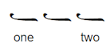
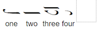
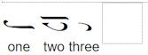
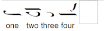
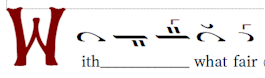
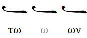

# Advanced

## Headers & Footers

To insert a header or footer, use the file menu: `Insert > Headers & Footers > Header` or `Insert > Headers & Footers > Footer`.

Headers and footers may also be turned on and off in the page setup dialog, whih is accessed through the main menu: `File > Page Setup`.


In the page setup dialog, you can control whether the first page has a different header and footer than the rest of the document, as well as whether odd and even pages have different headers.

### Page Numbers

To insert a page number in the header, type `$p`. When the document is printed, the token `$p` will be replaced with the correct page number in the header/footer of each page.


### Other Tokens

Several other tokens are available. Below is a list of currently supported tokens.

| Token | Description                   |
| ----- | ----------------------------- |
| `$p`  | Page Number                   |
| `$n`  | Number of Pages               |
| `$f`  | File Name (without extension) |
| `$F`  | File Path                     |

## Custom Mode Keys

Any rich text box can function as a mode key in the score. To enable this:

1. Click the rich text box.
2. In the bottom toolbar, check the `Change Mode` option.
3. Choose the starting note and scale.

If the mode key includes a **fthora**, specify the **parallage note**.  
_For example, triphonic hymns in the plagal of the fourth mode typically have a NI fthora on GA—so GA is the starting note, and NI is the parallage note._

Custom mode keys can be adapted for other languages by replacing the Greek term `ήχος` with a localized equivalent, such as `glas`, `mode`, `глас`, etc.

### Toolbar Shortcuts

The rich text toolbar provides several buttons to help insert mode-related symbols:



1. **Neume Signatures** – Inserts neumes used in mode key signatures.
2. **Martyriae** – Inserts martyriae (mode indicators).
3. **Plagal Symbol** – Inserts the Greek "plagal" symbol using the default text box font, allowing it to match the surrounding Greek text.

After inserting a symbol, click it to customize its **color**, **size**, **position**, and **spacing**.

### Positioning

When the `Inline` checkbox is selected for a rich text box, the box displays two lines:

- **Top Line** – Aligned so that the midpoint of the _oligon_ matches the vertical midpoint of the font.
- **Bottom Line** – Aligned with the lyrics line.

You can fine-tune their placement using the `Top Y Offset` and `Bottom Y Offset` inputs in the bottom toolbar.

By default, an inline text box is centered relative to its own width—which may be narrower than the page if neumes are placed before or after it. To center the box across the entire page, check the `Center on Page` option in the toolbar.

### Example

A sample file demonstrating various mode key configurations is available here:  
[byzx](http://github.com/neanes/neanes/blob/master/examples/Custom%20Mode%20Key%20Demo.byzx) | [PDF](http://github.com/neanes/neanes/blob/master/examples/Custom%20Mode%20Key%20Demo.pdf)

## Hyperlinks

The link feature in the rich text editor can be used to insert hyperlinks to quickly jump to other sections of the exported PDF. To insert a hyperlink, click on the element you want to jump to, then choose `Tools -> Copy Element Link` in the file menu. This places the link URL on the clipboard. Next, create a link in the rich text editor by clicking the link button in the rich text editor's toolbar, and then paste the copied link URL into the `Link URL` field.

## Fine-tuning Neume Positions

Sometimes the font is unable to properly position neumes when there are multiple supporting neumes. To fix collisions, either double-click the neume or click the `Positioning` button in the neume toolbar.


This will open the neume positioning dialog.


You can move neumes by either clicking a drag handle (the small blue box near the neume) and moving the mouse, or by editing the values in the `Left` and `Top` input boxes.

- To move a neume **left**, **decrease** the `Left` number.
- To move a neume **right**, **increase** the `Left` number.
- To move a neume **up**, **decrease** the `Top` number.
- To move a neume **down**, **increase** the `Top` number.

In the below example, we have corrected the collision between the heteron and the dipli.


## Advanced Lyrics Entry

While lyrics can be entered by clicking under a neume and typing, there is an alternate method of entering and manipulating lyrics.

Press <kbd>Ctrl</kbd>+<kbd>L</kbd> or select the `Edit -> Lyrics` from the file menu to open the lyrics toolbar.

As you type into the toolbar's text area, lyrics will be automatically assigned to the neumes. Conversely, as you add or remove neumes, or edit lyrics by clicking underneath a neume, the text area will automatically update with the current lyrics.

> [!TIP]
> You can quickly shift all lyrics left or right by editing the lyrics in the lyrics toolbar.

#### Example 1



If the neume with the lyrics `two` in the image above is deleted, the lyrics in the toolbar will change from

```
one two three four
```

to

```
one three four
```

#### Example 2

To leave a neume without any lyrics, use a single underscore.



Lyrics:

```
one _ two
```

### Locking Lyrics

To lock lyrics, select the `Lock Lyrics` checkbox in the lyrics toolbar. When lyrics are locked, you can only edit lyrics in the toolbar. In addition, when you add or remove neumes, the lyrics will automatically be assigned to the current neumes.

#### Example

Neumes:



Lyrics:

```
one two three four
```

If the second neume in the image above is deleted, the lyrics in the toolbar will not change, since they are locked. Instead, the lyrics will be assigned to the remaining three neumes, as shown below.



If you add a fourth neume, it will receive the lyrics `four`.



### Assigning Lyrics to Neumes

If you select a neume, you will see an `Accepts Lyrics` dropdown in the neume toolbar. This can take one of the following values.

| Value        | Meaning                                                                                                      |
| ------------ | ------------------------------------------------------------------------------------------------------------ |
| Default      | The neume will receive lyrics based on the neume itself. For example, rests never receive lyrics by default. |
| Yes          | The neume should always receive lyrics.                                                                      |
| No           | The neume should never receive lyrics.                                                                       |
| Melisma Only | The neume should only function as a melisma that contains a hyphen or underscore.                            |

The most useful of these options is `Melisma Only`. If the proper neumes are given this value, then you may omit underscores and extra hyphens in the lyrics toolbar text area. The neumes will automatically receive underscores or hyphens.

#### Example



When all the neumes in the image above have `Accepts Lyrics` set to `Default`, the lyrics will be written as the following.

```
With___ what fair
```

If you change the second and third neumes to `Melisma Only`, then the lyrics will be written as the following.

```
With what fair
```

You can tell Neanes to automatically set the `Accepts Lyrics` value for every neume in the score based on the current lyrics by pressing the `Save Current Melismas` button in the lyrics toolbar. So if your score looks like the image above, then pressing the `Save Current Melismas` button, will result in the second and third neumes being set to `Melisma Only` because they contain melismas. The other three neumes will be set to `Default`.

### An Example with Prosomoia

Let's say that you want to create a template for `Ποίοις εὐφημιῶν`.

You would begin by creating a new score and typing out the neumes and the lyrics as normal. Then open the lyrics toolbar and press the button labeled `Save Current Melismas`. This will update the `Accepts Lyrics` setting on each neume to match its current function in the hymn, based on the current lyrics. It is recommended that you lock the lyrics at this point.

Save this file as your template. There is an example of this template in the [examples](https://github.com/neanes/neanes/tree/master/examples) folder of this project's repository.

Copy the template file and open the copy, so that the original template file is preserved.

Next, type out the lyrics for your prosomoion in a word processor. For this example, we will use the text below.

```
With what fair crowns of praise shall we crown the divine and all-laudable hierarch? That clear trumpet sounding theology, the mouth of grace that doth breathe forth fire, the ven'rable vessel of the Spirit, the mighty unshaken pillar of the Church of Christ, the great and exceeding gladness of the world entire, the mighty river of wisdom of God's inspiration, and the lamp of the divine light, the bright and far-shining star that maketh creation radiant.
```

Next, either add hyphens yourself, or use a tool such as [Juicio Brennan's Hyphenator](https://juiciobrennan.com/hyphenator/) to add the hyphens. Below is the hyphenated text.

```
With what fair crowns of praise shall we crown the di-vine and all-laud-a-ble hier-arch? That clear trum-pet sound-ing the-ol-o-gy, the mouth of grace that doth breathe forth fire, the ven'-ra-ble ves-sel of the Spir-it, the might-y un-shak-en pil-lar of the Church of Christ, the great and ex-ceed-ing glad-ness of the world en-tire, the might-y riv-er of wis-dom of God's in-spi-ra-tion, and the lamp of the di-vine light, the bright and far-shin-ing star that mak-eth cre-a-tion ra-di-ant.
```

Copy and paste the hyphenated text into the lyrics toolbar. The lyrics will be automatically assigned to the correct neumes.

In this example, the prosomoion matches the automelon perfectly, but for other hymns you may need to make minor adjustments.

### Greek

When working with Greek lyrics, the hyphen is not used. Syllables should be separated by a single space and melismata should be indicated by an underscore. If a syllable ends in a consonant, the underscore should be placed at the end of the syllable.

For example, `των___` will be interpreted as the following.


