# Advanced

## Headers & Footers

Headers and footers can contain page numbers, document properties, and running text such as the current chapter or section title. They are useful for simple page numbering as well as book-style layouts with different left- and right-hand pages.

To add or edit a header or footer, use `Insert > Headers & Footers > Header` or `Insert > Headers & Footers > Footer`.

Headers and footers can be turned on and off in the page setup dialog, which is accessed through `File > Page Setup`.

In the page setup dialog, you can choose whether headers and footers are shown, whether the first page is different, whether odd and even pages are different, whether chapter-opening pages are different, and whether new header/footer content uses plain text boxes or rich text boxes.

### Header and Footer Variants

Neanes provides several variants for headers and footers. A variant is a separate version of the header or footer that is used only on certain pages.

| Variant         | Used when                                                                                         |
| --------------- | ------------------------------------------------------------------------------------------------- |
| Default         | No more specific variant applies                                                                  |
| First page      | `Different first page` is enabled and the page is the first page of the score                     |
| Odd             | `Different odd and even` is enabled and the displayed page number is odd                          |
| Even            | `Different odd and even` is enabled and the displayed page number is even                         |
| Chapter opening | `Different chapter opening` is enabled and Neanes detects the start of a new chapter on that page |

Each variant has left, center, and right content areas. For example, a book-style header might place the page number on the outside edge and the current chapter or section title in the center.

### Which Variant Wins

For each page, Neanes picks exactly one header variant and one footer variant. The selection order is:

1. First page
2. Chapter opening
3. Odd or even
4. Default

This means the first-page header/footer wins over the chapter-opening header/footer. A first page that also starts a chapter still uses the first-page variant when `Different first page` is enabled.

Chapter-opening variants win over odd/even variants. If `Different chapter opening` is turned off, chapter-opening pages use the odd, even, or default variant just like any other page.

### Placeholder Tokens

You can type placeholder tokens directly into a header or footer. Neanes replaces them when displaying, printing, or exporting the score.

| Token       | Inserts                                  |
| ----------- | ---------------------------------------- |
| `$p`        | Displayed page number                    |
| `$n`        | Displayed total page count               |
| `$f`        | File name without extension              |
| `$F`        | Full file path                           |
| `$:author`  | Author from `File > Document Properties` |
| `$:title`   | Title from `File > Document Properties`  |
| `$:chapter` | Current chapter running marker           |
| `$:section` | Current section running marker           |

If a token has no value yet, Neanes substitutes an empty string.

### Page Numbers

To insert a page number in a header or footer, type `$p`.

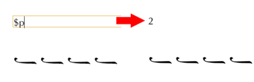

`$p` uses the displayed page number, so it respects the `First page number` setting. For example, if `First page number` is `3`, the first page displays as page `3`. If Eastern Arabic numerals are enabled in page setup, page-number tokens use Eastern Arabic digits.

`$n` uses the displayed number of the last page. For example, if a 10-page score starts at page `3`, `$n` displays `12`.

### Document Properties

Use `File > Document Properties` to set the title and author used by `$:title` and `$:author`.

These values are document-wide. They do not change from page to page.

### Running Markers

Running markers let headers and footers show text from the score body, such as the current chapter or section title.

Neanes supports two running-marker roles:

- `Chapter`
- `Section`

To create a running marker:

1. Select a text box or rich text box in the score body.
2. Open `View > Properties`.
3. Set the running-marker role to `Chapter` or `Section`.
4. Optionally enter `Running Marker Text`.

If `Running Marker Text` is filled in, Neanes uses that value. If it is empty, Neanes uses the visible text from the text box itself.

Running markers are read from body text boxes and rich text boxes only. Headers and footers can refer to running markers with `$:chapter` and `$:section`, but header/footer text does not define new running markers.

Neanes reads running markers page by page:

- The first marker of each role on a page becomes the value for that page.
- If a page has no new marker, it keeps the value from the previous page.
- When a new chapter marker starts a chapter-opening page, the current section marker is cleared unless that page also has a new section marker.

For example, if page 4 contains a chapter marker named `Matins`, then `$:chapter` displays `Matins` on page 4 and following pages until another chapter marker appears.

### Chapter-Opening Pages

A page is a chapter-opening page when the first `chapter` running marker on that page is different from the chapter marker already in effect.

This can be subtle:

- The chapter marker must be in the score body on that page.
- Repeating the same chapter marker later does not create another chapter opening.
- Moving a chapter marker to a different page can change which page uses the chapter-opening header/footer.
- If the first page is also a chapter opening, the first-page variant is used when `Different first page` is enabled.

Chapter-opening variants are useful when you want to suppress running heads at the start of each chapter while keeping a centered footer page number.

### Facing Pages and Odd/Even Pages

Facing pages are designed for book-style layouts with inside and outside margins.

Odd/even header and footer selection is based on the displayed page number, not simply the page's position in the file. If `First page number` is `2`, the first page is treated as an even page for header/footer selection.

When facing pages are on:

- In left-to-right documents, odd displayed pages are right-hand pages.
- In right-to-left documents, even displayed pages are right-hand pages.

When facing pages are off, every page is treated as a right-hand page for layout purposes.

### Default Starting Layouts

New scores start with generated header/footer content.

Without facing pages:

- Headers start empty.
- Footers start with a centered page number: `$p`

With facing pages:

- Ordinary headers are generated in a book-style layout.
- Ordinary footers start empty.
- Chapter-opening headers start empty.
- Chapter-opening footers start with a centered page number: `$p`

If you enable facing pages on a score that is still using the untouched generated defaults, Neanes may automatically enable `Different odd and even` so that the generated templates continue to make sense as facing-page headers.

### Common Patterns

Here are a few common setups.

- Page numbers on every page: enable footers and place `$p` in the default footer.
- No running head on the title page: enable `Different first page` and leave the first-page header blank.
- Book-style running heads: enable facing pages and `Different odd and even`, then use `$:chapter`, `$:section`, and `$p` in the odd and even headers.
- Chapter openings without running heads: enable `Different chapter opening`, leave the chapter-opening header blank, and keep `$p` in the chapter-opening footer.

### Things to Watch For

- Changing `First page number` can switch which pages use odd and even variants.
- Moving a running-marker text box can change where a chapter opening is detected.
- Running markers come only from body text boxes and rich text boxes, not from header/footer content.
- Header/footer variants are global for the whole score. Neanes does not provide separate header/footer sets for different document sections.
- Tokens are simple placeholders. They do not support conditional logic.

## Custom Mode Keys

Any rich text box can function as a mode key in the score. To enable this:

1. Click the rich text box.
2. Open `View -> Properties` and check the `Change Mode` option.
3. Choose the starting note and scale.

If the mode key includes a **fthora**, specify the **parallage note**.  
_For example, triphonic hymns in the plagal of the fourth mode typically have a NI fthora on GA—so GA is the starting note, and NI is the parallage note._

Custom mode keys can be adapted for other languages by replacing the Greek term `ήχος` with a localized equivalent, such as `glas`, `mode`, `глас`, etc.

### Toolbar Shortcuts

The rich text toolbar provides several buttons to help insert mode-related symbols:

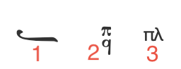

1. **Neume Signatures** – Inserts neumes used in mode key signatures.
2. **Martyriae** – Inserts martyriae (mode indicators).
3. **Plagal Symbol** – Inserts the Greek "plagal" symbol using the default text box font, allowing it to match the surrounding Greek text.

After inserting a symbol, click it to customize its **color**, **size**, **position**, and **spacing**.

### Positioning

When the `Inline` checkbox is selected for a rich text box, the box displays two lines:

- **Top Line** – Aligned so that the midpoint of the _oligon_ matches the vertical midpoint of the font.
- **Bottom Line** – Aligned with the lyrics line.

You can fine-tune their placement using the `Top Y Offset` and `Bottom Y Offset` inputs in the Properties pane.

By default, an inline text box is centered relative to its own width—which may be narrower than the page if neumes are placed before or after it. To center the box across the entire page, check the `Center on Page` option in the Properties pane.

### Example

A sample file demonstrating various mode key configurations is available here:  
[byzx](http://github.com/neanes/neanes/blob/master/examples/Custom%20Mode%20Key%20Demo.byzx) | [PDF](http://github.com/neanes/neanes/blob/master/examples/Custom%20Mode%20Key%20Demo.pdf)

## Hyperlinks

The link feature in the rich text editor can be used to insert hyperlinks to quickly jump to other sections of the exported PDF. To insert a hyperlink, click on the element you want to jump to, then choose `Tools -> Copy Element Link` in the file menu. This places the link URL on the clipboard. Next, create a link in the rich text editor by clicking the link button in the rich text editor's toolbar, and then paste the copied link URL into the `Link URL` field.

## Fine-tuning Neume Positions

Sometimes the font is unable to properly position neumes when there are multiple supporting neumes. To fix collisions, either double-click the neume, right-click the neume and choose `Positioning`, or open `View -> Properties` and click the `Positioning` button.

This will open the neume positioning dialog.

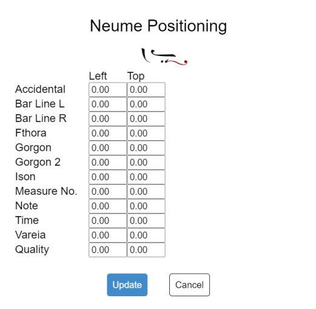

You can move neumes by either clicking a drag handle (the small blue box near the neume) and moving the mouse, or by editing the values in the `Left` and `Top` input boxes.

- To move a neume **left**, **decrease** the `Left` number.
- To move a neume **right**, **increase** the `Left` number.
- To move a neume **up**, **decrease** the `Top` number.
- To move a neume **down**, **increase** the `Top` number.

In the example below, we have corrected the collision between the heteron and the dipli.

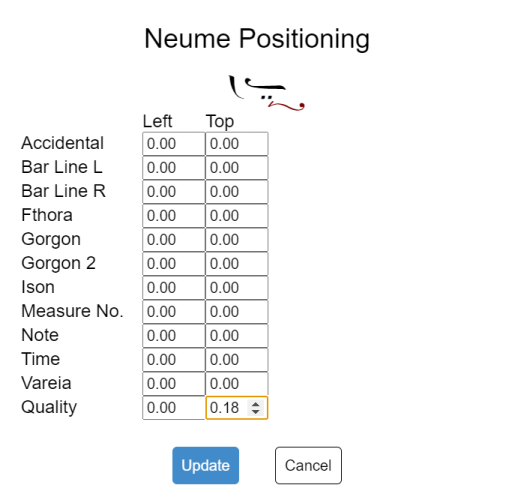

## Advanced Lyrics Entry

While lyrics can be entered by clicking under a neume and typing, there is an alternate method of entering and manipulating lyrics.

Press <kbd>Ctrl</kbd>+<kbd>L</kbd> or select `View -> Lyrics` from the menu to show or hide the Lyrics pane.

As you type into the pane's text area, lyrics will be automatically assigned to the neumes. Conversely, as you add or remove neumes, or edit lyrics by clicking underneath a neume, the text area will automatically update with the current lyrics.

> [!TIP]
> You can quickly shift all lyrics left or right by editing the lyrics in the Lyrics pane.

### Example 1

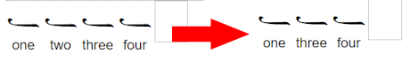

If the neume with the lyrics `two` in the image above is deleted, the lyrics in the pane will change from

```text
one two three four
```

to

```text
one three four
```

### Example 2

To leave a neume without any lyrics, use a single underscore.

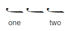

Lyrics:

```text
one _ two
```

### Locking Lyrics

To lock lyrics, select the `Lock Lyrics` checkbox in the Lyrics pane. When lyrics are locked, you can only edit lyrics in the pane. In addition, when you add or remove neumes, the lyrics will automatically be assigned to the current neumes.

#### Example

Neumes:

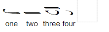

Lyrics:

```text
one two three four
```

If the second neume in the image above is deleted, the lyrics in the pane will not change, since they are locked. Instead, the lyrics will be assigned to the remaining three neumes, as shown below.

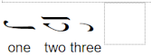

If you add a fourth neume, it will receive the lyrics `four`.

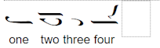

### Assigning Lyrics to Neumes

If you select a neume and open `View -> Properties`, you will see an `Accepts Lyrics` dropdown. This can take one of the following values.

| Value        | Meaning                                                                                                      |
| ------------ | ------------------------------------------------------------------------------------------------------------ |
| Default      | The neume will receive lyrics based on the neume itself. For example, rests never receive lyrics by default. |
| Yes          | The neume should always receive lyrics.                                                                      |
| No           | The neume should never receive lyrics.                                                                       |
| Melisma Only | The neume should only function as a melisma that contains a hyphen or underscore.                            |

The most useful of these options is `Melisma Only`. If the proper neumes are given this value, then you may omit underscores and extra hyphens in the Lyrics pane text area. The neumes will automatically receive underscores or hyphens.

#### Example

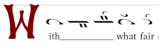

When all the neumes in the image above have `Accepts Lyrics` set to `Default`, the lyrics will be written as the following.

```text
With___ what fair
```

If you change the second and third neumes to `Melisma Only`, then the lyrics will be written as the following.

```text
With what fair
```

You can tell Neanes to automatically set the `Accepts Lyrics` value for every neume in the score based on the current lyrics by pressing the `Save Current Melismas` button in the Lyrics pane. So if your score looks like the image above, then pressing the `Save Current Melismas` button, will result in the second and third neumes being set to `Melisma Only` because they contain melismas. The other three neumes will be set to `Default`.

### An Example with Prosomoia

Let's say that you want to create a template for `Ποίοις εὐφημιῶν`.

You would begin by creating a new score and typing out the neumes and the lyrics as normal. Then open the Lyrics pane and press the button labeled `Save Current Melismas`. This will update the `Accepts Lyrics` setting on each neume to match its current function in the hymn, based on the current lyrics. It is recommended that you lock the lyrics at this point.

Save this file as your template. There is an example of this template in the [examples](https://github.com/neanes/neanes/tree/master/examples) folder of this project's repository.

Copy the template file and open the copy, so that the original template file is preserved.

Next, type out the lyrics for your prosomoion in a word processor. For this example, we will use the text below.

```text
With what fair crowns of praise shall we crown the divine and all-laudable hierarch? That clear trumpet sounding theology, the mouth of grace that doth breathe forth fire, the ven'rable vessel of the Spirit, the mighty unshaken pillar of the Church of Christ, the great and exceeding gladness of the world entire, the mighty river of wisdom of God's inspiration, and the lamp of the divine light, the bright and far-shining star that maketh creation radiant.
```

Next, either add hyphens yourself, or use a tool such as [Juicio Brennan's Hyphenator](https://juiciobrennan.com/hyphenator/) to add the hyphens. Below is the hyphenated text.

```text
With what fair crowns of praise shall we crown the di-vine and all-laud-a-ble hier-arch? That clear trum-pet sound-ing the-ol-o-gy, the mouth of grace that doth breathe forth fire, the ven'-ra-ble ves-sel of the Spir-it, the might-y un-shak-en pil-lar of the Church of Christ, the great and ex-ceed-ing glad-ness of the world en-tire, the might-y riv-er of wis-dom of God's in-spi-ra-tion, and the lamp of the di-vine light, the bright and far-shin-ing star that mak-eth cre-a-tion ra-di-ant.
```

Copy and paste the hyphenated text into the Lyrics pane. The lyrics will be automatically assigned to the correct neumes.

In this example, the prosomoion matches the automelon perfectly, but for other hymns you may need to make minor adjustments.

### Greek

When working with Greek lyrics, the hyphen is not used. Syllables should be separated by a single space and melismata should be indicated by an underscore. If a syllable ends in a consonant, the underscore should be placed at the end of the syllable.

For example, `των___` will be interpreted as the following.

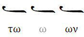
