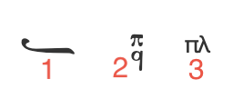

# Advanced Workflows

These workflows are useful when a score needs something beyond the supplied initial martyriæ or the automatic page layout.

## Create a custom initial martyria

Any rich text box can change the musical mode. This lets you build an initial martyria that is not available in the Initial Martyria dialog or write its surrounding text in another language.

1. Choose `Insert > Rich Text Box`.
2. Enter and format the text of the initial martyria.
3. Select the box and open `View > Properties`.
4. Enable `Change Mode`, then choose the starting note and scale.
5. If the initial martyria contains a fthora, set the `Parallagē Note` as well.

For example, a triphonic hymn in the plagal of the fourth mode may have a Ni fthora on Ga. In that case, Ga is the starting note and Ni is the parallagē note.

You can replace the Greek word `ήχος` with `mode`, `glas`, `глас`, or another suitable term without changing how the element affects the melody.

### Insert the symbols

The rich-text toolbar has controls for inserting neumes, martyriæ, and the Greek plagal symbol.

After inserting a neume or martyria, select it to adjust its color, size, position, and spacing.

### Position an inline initial martyria

Enable `Inline` when the initial martyria should sit within the musical flow. The box then has two content lines:

- The top line aligns with the neumes.
- The bottom line aligns with the lyrics.

Use `Top Y Offset` and `Bottom Y Offset` in Properties for small vertical corrections. Enable `Center on Page` when the box should be centered across the page rather than within the remaining space on its line.

Example files show several configurations: [editable BYZX](https://github.com/neanes/neanes/blob/master/examples/Custom%20Mode%20Key%20Demo.byzx) and [PDF](https://github.com/neanes/neanes/blob/master/examples/Custom%20Mode%20Key%20Demo.pdf).

## Build a prosomoion template

A prosomoion reuses the melodic and syllabic pattern of an automelon. Prepare the automelon with `Save Current Melismas`, lock its lyrics, and save it as a reusable template. The [prosomoion tutorial](/guide/lyrics.html#create-a-prosomoion-from-an-automelon) explains the complete workflow, including `Accepts Lyrics`, replacement text, and Greek syllables.

## Set up a book

Use `File > Page Setup` for facing pages and header/footer variants. Give each source heading a `Running Marker Role` when its text should appear in a running header. The [Page Layout and Books guide](/guide/page-layout.html) covers page-number tokens, chapter openings, variant precedence, and common book layouts.

## Correct a difficult collision

If the same collision occurs throughout the score, begin with Page Setup or the automatic line breaks. For one isolated collision, open the selected neume's Positioning dialog and move the affected sign. See [Fine-tune positions](/guide/writing-music.html#fine-tune-positions) for an illustrated example.

## Design repeated text

Use `Format > Paragraph Styles` when titles, headings, lyrics, or other repeated text should share their formatting. The [Text, Images, and Styles guide](/guide/text-and-styles.html#apply-paragraph-styles) explains how to apply styles, inherit settings, and handle local formatting.
