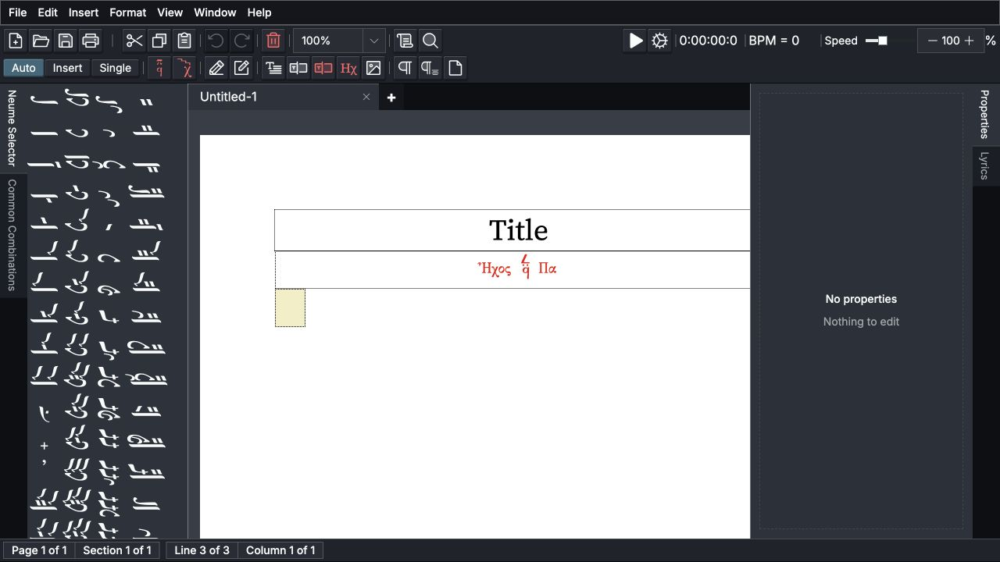
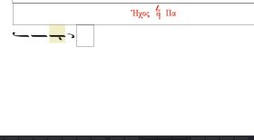
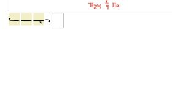
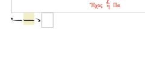
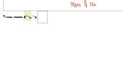
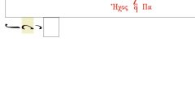

# Getting Around and Editing a Score

Neanes keeps the score, the tools used to enter music, and the settings for the selected item in one editor window. This chapter explains how to move around that window and make everyday changes without losing your place.

## Find your way around the editor

<figure class="guide-editor-overview">
  

    
    1
    2
    3
    4
    5
    6
  

  <figcaption>The main areas of the editor correspond to the numbered list below.</figcaption>
</figure>

The main areas are:

1. **Main toolbar:** common file and editing commands, entry modes, music and text insertion, breaks, zoom, and playback.
2. **Neume Selector:** quantitative neumes that you can click to enter. The Common Combinations tab contains reusable groups.
3. **Workspace tabs:** one tab for each open score. A star before a name means that the score has unsaved changes. Use the `+` button to create another score.
4. **Score page:** the document itself. The outlined item is the current selection or entry position.
5. **Properties:** all settings that apply to the selected item. The toolbar along the bottom of the window contains the most common settings for the same item.
6. **Status bar:** the current page, section, line, and column. When available, it also shows the selected neume's calculated note.

You do not need to keep every pane open. Use `View > Neume Selector`, `View > Common Combinations`, `View > Properties`, and `View > Lyrics` to show or hide them. Drag a pane's tab to dock it elsewhere or make it float. Use `View > Reset Layout` if you want to restore the original arrangement, pane sections, status bar, and zoom.

## Understand the current selection

Most commands apply to the selected element. Click a neume, martyria, tempo sign, text box, or other element to select it. The Properties pane and bottom toolbar then change to show the controls for that kind of element.

The selection is also the entry position:

- A supporting sign changes the selected neume.
- A new quantitative neume, martyria, tempo sign, or pasted passage uses the selected element as its starting point.
- The active entry mode determines whether the next element is replaced, a new element is inserted, or only the selected element is changed.

If a command appears to affect the wrong place, first check which element is outlined and which entry mode is active.

### Move through the score

Click an element, then use <kbd>Left Arrow</kbd> and <kbd>Right Arrow</kbd> to move between elements. In a right-to-left score, the arrow keys still follow the visual direction of the score.

Use <kbd>Ctrl</kbd>/<kbd>Cmd</kbd>+<kbd>Down Arrow</kbd> on a neume to move to its lyric box. Use <kbd>Ctrl</kbd>/<kbd>Cmd</kbd>+<kbd>Up Arrow</kbd> to return to the neume.

Choose **Find** <PhMagnifyingGlass class="guide-action-icon" weight="duotone" aria-hidden="true" /> in the main toolbar, choose `Edit > Find`, or press <kbd>Ctrl</kbd>/<kbd>Cmd</kbd>+<kbd>F</kbd> to find text in the score. Neanes selects the next matching element and brings it into view.

### Select a passage

To select consecutive score elements:

- Hold <kbd>Shift</kbd> and click the last element in the passage.
- Or hold <kbd>Shift</kbd> and press <kbd>Left Arrow</kbd> or <kbd>Right Arrow</kbd> to extend the selection.
- Choose `Edit > Select All` to select the whole score body.

A range can include notes, martyriæ, tempo signs, and text elements. Commands such as cut, copy, delete, and Paste Format operate on the selected range when the included element types support them.

  <figure>
    
    <figcaption><strong>Single selection.</strong> One neume is highlighted.</figcaption>
  </figure>
  <figure>
    
    <figcaption><strong>Range selection.</strong> Every selected element is highlighted.</figcaption>
  </figure>

## Choose how new music is entered

The Auto, Insert, and Single buttons in the main toolbar control what happens when you choose a quantitative neume or insert another musical element.
The active mode appears pressed and highlighted in the toolbar.

| Mode       | What happens                                                                                  | Use it when...                                        |
| ---------- | --------------------------------------------------------------------------------------------- | ----------------------------------------------------- |
| **Auto**   | Neanes advances to the next position and changes that element. At the end, it adds a new one. | Entering a passage from left to right                 |
| **Insert** | Neanes adds a new element immediately after the selected one. Existing music moves forward.   | Filling in something that was omitted                 |
| **Single** | Neanes changes the selected element and does not advance.                                     | Correcting or experimenting with one existing element |

Supporting signs such as gorgons, fthoræ, and accidentals always change the selected neume without advancing.

Imagine that a passage contains `A B C` and `B` is selected:

| Action                       | Result                       |
| ---------------------------- | ---------------------------- |
| Enter `X` in **Auto** mode   | `A B X`, with `X` selected   |
| Enter `X` in **Insert** mode | `A B X C`, with `X` selected |
| Enter `X` in **Single** mode | `A X C`, with `X` selected   |

<figure class="guide-entry-mode-before">
  
  <figcaption><strong>Before:</strong> the middle neume, <code>B</code>, is an Oligon and is selected in the shared starting passage.</figcaption>
</figure>

  <figure>
    
    <figcaption><strong>Auto:</strong> the next neume is replaced and selected.</figcaption>
  </figure>
  <figure>
    
    <figcaption><strong>Insert:</strong> a new neume is added and selected.</figcaption>
  </figure>
  <figure>
    
    <figcaption><strong>Single:</strong> only the selected neume is replaced.</figcaption>
  </figure>

<kbd>Ctrl</kbd>/<kbd>Cmd</kbd>+<kbd>I</kbd> and <kbd>Ctrl</kbd>/<kbd>Cmd</kbd>+<kbd>U</kbd> cycle through the entry modes in opposite directions.

::: tip Choose a safe mode for the task
Use Auto for continuous entry, Insert for adding missing material, and Single for a correction that should not move the selection. If existing music changes unexpectedly, undo the edit and check the active mode before trying again.
:::

For fast neume entry, see the [Neume Keyboard](/guide/keyboard.html).

## Delete, copy, and rearrange music

### Delete elements

Select one element or a range, then press <kbd>Delete</kbd> or choose **Delete** <PhTrash class="guide-action-icon" weight="duotone" aria-hidden="true" /> in the main toolbar.

<kbd>Backspace</kbd> removes the element immediately before the current selection. This is useful while entering a passage because the current position stays in place. Use <kbd>Delete</kbd> when you want to remove the selected element itself.

### Cut, copy, and paste

Select the elements, then use **Cut** <PhScissors class="guide-action-icon" weight="duotone" aria-hidden="true" />, **Copy** <PhCopy class="guide-action-icon" weight="duotone" aria-hidden="true" />, or **Paste** <PhClipboardText class="guide-action-icon" weight="duotone" aria-hidden="true" /> in the main toolbar. The same commands are available in the Edit menu.

Pasting follows the active entry mode:

- **Auto** advances and begins replacing elements at the next position.
- **Insert** adds the copied passage after the selected element.
- **Single** begins replacing elements at the selected element.

Ordinary paste does not copy lyrics. Choose `Edit > Paste with Lyrics` when the copied syllables should move with the notes.

### Copy formatting without replacing music

Use `Edit > Copy Format` when one note or text box already looks the way you want. Select another element or a range of the same kind and choose `Edit > Paste Format`. The content stays in place while the applicable formatting is transferred.

## Undo mistakes

Choose **Undo** <PhArrowCounterClockwise class="guide-action-icon" aria-hidden="true" /> in the main toolbar, choose `Edit > Undo`, or press <kbd>Ctrl</kbd>/<kbd>Cmd</kbd>+<kbd>Z</kbd> to reverse an edit. Choose **Redo** <PhArrowClockwise class="guide-action-icon" aria-hidden="true" /> or `Edit > Redo` to restore it. Undo and redo apply only to the active score, so switching workspace tabs does not mix the histories of different scores.

If a passage changes unexpectedly:

1. Undo the edit.
2. Check the outlined selection or range.
3. Check whether Auto, Insert, or Single is active.
4. Repeat the edit in the appropriate mode.

## Work with panes, zoom, and open scores

### Arrange the panes

The Neume Selector and Properties panes are visible in the default layout. The Properties pane groups related controls into collapsible sections. Pane visibility, positions, sizes, and collapsed sections are remembered.

If a pane is missing, turn it on from the View menu. If the layout becomes difficult to use, choose `View > Reset Layout`.

### Change the view

Use the zoom control in the main toolbar or `View > Zoom`. You can choose a percentage, return to actual size, or fit the page width, text width, or whole page. Zoom changes only the editor view; it does not change the printed score.

Use `View > Status Bar` to show or hide the position information at the bottom of the editor.

### Work with more than one score

Each open score has its own workspace tab, selection, zoom, undo history, and unsaved state. Click a tab to switch scores. Use the Window menu to move to the previous or next tab, and right-click a tab for commands that close it or close neighboring tabs.

## Use saved neume groups

Open `View > Common Combinations` to show the Common Combinations pane. Choose a combination to enter its neumes at the current position. The active entry mode controls whether the group replaces or is inserted into the existing music.

To save your own combination, select two or more consecutive notes. Do not include a martyria, tempo sign, text box, or other kind of element. Right-click one of the selected notes and choose `Save as combo`. Your saved combination appears in the same pane, where you can reorder or remove it.

## Practice the editing workflow

Try this short exercise in a new score:

1. Leave **Auto** active and enter four quantitative neumes. Notice that the selection advances after each one.
2. Select the second neume and choose **Single**. Enter a different quantitative neume. Only the selected neume changes.
3. Choose **Insert** and enter another neume. The new neume appears after the selection without replacing the following music.
4. Click beneath the first few neumes and enter lyrics. Select two notes and copy them. See [Lyrics](/guide/lyrics.html) for more ways to enter and edit text beneath the music.
5. Choose **Insert**, select the last note, and paste. Repeat with `Edit > Paste with Lyrics` to see the difference.
6. Select a range with <kbd>Shift</kbd>+<kbd>Right Arrow</kbd>, then delete it.
7. Undo the deletion, then redo it.
8. Open the Lyrics pane, move the Properties pane, change the zoom, and use `View > Reset Layout` to restore the workspace.

After completing the exercise, continue with [Writing Music](/guide/writing-music.html) for martyriæ, supporting signs, barlines, breaks, and fine positioning.
