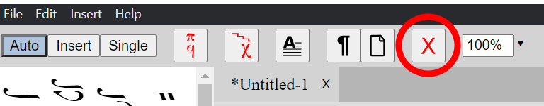
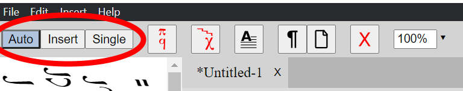
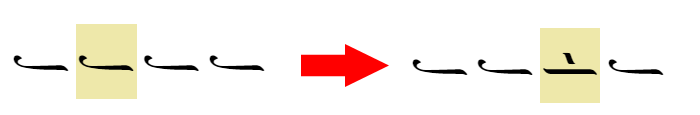
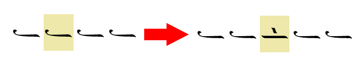
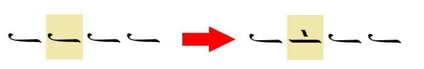

# Editor Basics

## Find the tools you need

The editor uses dockable panes. Use `View > Neume Selector`, `View > Common Combinations`, `View > Properties`, and `View > Lyrics` to show or hide them. The Neume Selector and Properties panes are initially visible. The Properties pane changes with the selected element and groups its controls into collapsible sections.

Use `View > Reset Layout` to restore the pane layout, collapsed pane sections, status-bar visibility, and zoom defaults. The View menu also provides zoom in, zoom out, actual-size, and fit modes.

## Select and change an element

Click an element to select it. Its contextual toolbar appears along the bottom; `View > Properties` exposes the complete type-specific settings. Select an element and use the main-toolbar Delete button to remove it.

Use `Edit > Undo` and `Edit > Redo` to reverse or restore score edits. Standard copy and paste work with score elements. `Edit > Paste with Lyrics` includes copied lyrics; ordinary paste does not. `Edit > Copy Format` and `Edit > Paste Format` transfer formatting without replacing the selected score content.

## Choose an entry mode

Use the Auto, Insert, and Single controls in the main toolbar. <kbd>Ctrl</kbd>/<kbd>Cmd</kbd>+<kbd>U</kbd> and <kbd>Ctrl</kbd>/<kbd>Cmd</kbd>+<kbd>I</kbd> cycle through them in opposite directions.

- **Auto:** a quantitative neume advances to the next position and updates it. Supporting signs modify the current note without advancing.
- **Insert:** adds a new element immediately after the current position rather than replacing the next position.
- **Single:** changes the selected element and does not advance.

For fast entry, see the [Neume Keyboard](/guide/keyboard.html).

## Use saved neume groups

Open `View > Common Combinations` to show the Common Combinations pane. Choose a combination to enter its neumes at the current position. This is useful for groups that occur often.

To save your own combination, select two or more consecutive notes. Do not include a martyria, tempo sign, text box, or other kind of element. Right-click one of the selected notes and choose `Save as combo`. Your saved combination appears in the same pane, where you can reorder or remove it.
