# Get Started

## Creating a new score

To create a new score, use the file menu: `File -> New`. This will give you a template containing a title and a mode key.

## Updating the title

To update the title, click on it and begin typing.

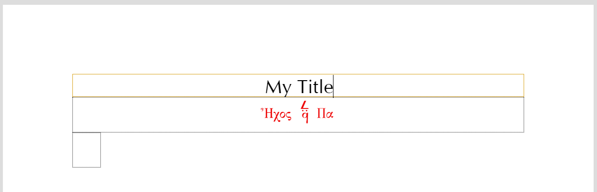

While editing the title, a toolbar will appear at the bottom of the window. This toolbar can be used to change the size, color, font, and alignment of the text.

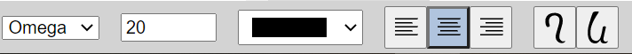

## Updating the mode key

To update the mode key, double click the current mode key to open the mode key dialog. You can also launch the dialog by clicking the mode key once, and pressing `Change Key` in the toolbar at the bottom of the window.

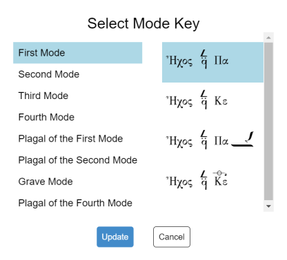

In the mode key dialog, select the mode on the left, and then pick the appropriate signature on the right. Most common signatures should be present in the dialog. Many signatures can be written in several different ways, and not all variations have been included. If a signature is missing, request it by [opening an issue](https://github.com/neanes/neanes/issues/new).

While the mode key is selected, a toolbar at the bottom the screen will be visible that allows you to change the color, size, and alignment of the key.

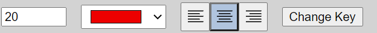

> [!NOTE]
> For more complex configurations, see the [Custom Mode Keys](./advanced.md#custom-mode-keys) section in the advanced guide.

## Entering Neumes

Quantitative neumes are inserted by clicking the desired neume in the panel on the left side of the window. Some buttons in this panel will open a menu containing more options. To operate this menu, click and hold the mouse button, select the desired neume, and then release the mouse button.

Supporting neumes such as fthoras, gorgons, accidentals, etc. can be inserted by using the toolbar that appears on the bottom of the screen when a neume is selected.

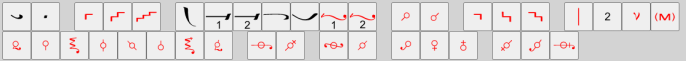

Some buttons in this toolbar will open a menu containing more options. To operate this menu, click and hold the mouse button, select the desired neume, and then release the mouse button.

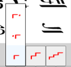

Neumes that are combined with kentimata can take supporting neumes on more than one neume component. To select which neume a gorgon, fthora, or accidental should be placed on, use the `Neume Select` buttons that appear in the toolbar when the neume is selected.

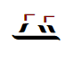

#### Keyboard Shortcuts

Most common neumes have keyboard shortcuts. See [Neume Keyboard](./keyboard.html) for more information.

### Martyria

To insert a martyria, use the martyria button in main toolbar. The note and root sign of the martyria are automatically calculated based on the mode key and fthoras placed above neumes. If the melody leaves the range generally used by traditional Byzantine Chant, the martyria will not display properly.

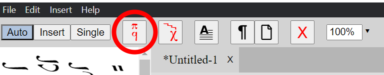

#### Overrides

In some cases, you may wish to override the note or scale of the martyria. For example, sticheraric hymns of the plagal of the first mode usually end on Δη, but the next hymn in the sequence will begin on Πα. In this case, a martyria of Πα may be written at the end of the first hymn, even though the last note is Δη.

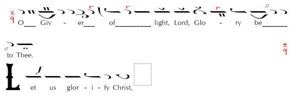

To override a martyria, uncheck the `Auto` checkbox in the martyria toolbar and choose the desired note or scale.

### Tempo

To insert a tempo marker, click and hold the tempo button in the main toolbar.

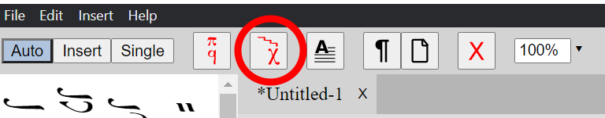

This will open a menu of tempo markers. While continuing to hold the mouse button down, select the desired tempo marker and then release the mouse button.

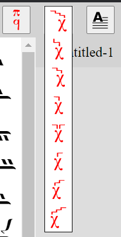

### Barlines

To insert a barline, click and hold the barline button in the toolbar that appears on the bottom of the screen.

Barlines are of two types: long and short. Short barlines will automatically be positioned above a multi-neume group or martyria.

For best results, apply barlines to the left of a given neume rather than to the right of the preceding neume; this will automatically apply the barline to the right of the preceding neume if the given neume begins a new line. Similarly, apply barlines to the top or right of a given martyria rather than to the left of the subsequent neume; this will automatically apply the barline to the left of the subsequent neume if the subsequent neume beings a new line.

## Entry Modes

There are three modes of neume entry.

- Auto Mode
- Insert Mode
- Single Edit Mode

To change the entry mode, click the `Auto`, `Insert`, or `Single` buttons in the main toolbar. You may also use the keyboard shortcuts <kbd>Ctrl</kbd>+<kbd>U</kbd> and <kbd>Ctrl</kbd>+<kbd>I</kbd> to cycle through the modes left and right, respectively.

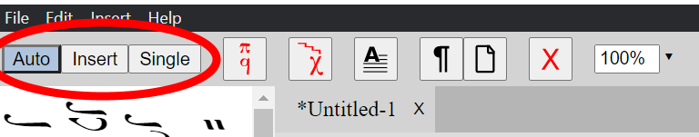

### Auto Mode

When creating a new score, you will most likely want to use Auto Mode. In Auto Mode, clicking a quantitative neume will advance the cursor to the right and set the neume. When a supporting neume is clicked, such as a gorgon or a fthora, the neume will be added to the currently selected neume, without advancing the cursor.

This mode allows you to quickly enter neumes by clicking the quantitative neumes in left panel. You can either enter all the quantitative neumes rapidly, and then go back and add the gorgon, fthora, etc., or you can click a quantitative neume, click the gorgon, click another quantitative neume, etc.

If you make a mistake, and wish to go back a character, press the left arrow key to move the cursor back to the left and continue entering neumes. The mistake will be overwritten.

#### Example

### Insert Mode

If you need to insert neumes in the middle of the score, then you should use Insert Mode. This mode functions similarly to Auto Mode, except neumes are not overwritten, but are instead inserted to the right of the current cursor position.

#### Example

### Single Edit Mode

In Single Edit Mode, clicking a quantitative neume updates the currently selected neume without advancing the cursor. This can be used to correct a single mistake by clicking directly on the neume and changing it.

#### Example

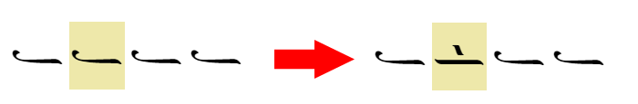

## Removing Neumes and Other Elements

To remove a neume, text box, mode key, or other element, select it and press the `Delete` button in the main toolbar.

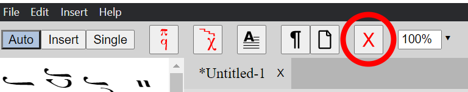

## Inserting Lyrics

To insert lyrics, click on the space just below a neume and begin typing.

- To move to the next lyric box, press `Space`, `Tab`, or `Ctrl + Right Arrow`.
- To insert an actual space character, press `Ctrl + Space`.
- To move to the previous lyric box, press `Ctrl + Left Arrow`.
- If you press the `Left Arrow` key while the cursor is at the beginning of a lyric box, then the cursor will move to the previous lyric box.
- If you press the `Right Arrow` key while the cursor is at the end of a lyric box, then the cursor will move to the next lyric box.
- To move from a neume to its lyrics, press `Ctrl + Down Arrow`.
- To move from the lyrics back to the neume, press `Ctrl + Up Arrow`.

There is a more advanced method of editing lyrics that is described [here](./advanced.html#advanced-lyrics-entry). The advanced method can be used to quickly alter the lyrics for many neumes at once, shift all lyrics left or right, or to create prosomoia.

### Melismas

To create a melisma, end your lyrics with an underscore or hyphen (`_` or `-`). To continue the melisma, set the lyrics for each neume in the melisma to a single underscore or hyphen. The full melisma will be drawn for you.

To insert hyphens or underscores without creating a melisma, hold <kbd>Ctrl</kbd> while typing the character.

#### Greek

To continue the final vowel or vowels of a syllable that ends in a vowel, use an underscore (`_`). The vowel or vowels will appear slightly transparent to distinguish them from non-melismatic vowels.

For example, to add a melisma to the word `και`, type <kbd>και\_</kbd> <kbd>\_</kbd> <kbd>\_</kbd>.
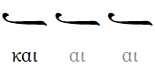

To continue the inner vowel or vowels in a single syllable that ends with a consonant, use a hyphen (`-`).

For example, to add a melisma to the word `των`, type <kbd>τω-</kbd> <kbd>-</kbd> <kbd>ων</kbd>.

> [!IMPORTANT]
> Although there is no visual distinction between using a hyphen or underscore, the character chosen is used to distinguish between `των` and `τω ων` in the [lyrics toolbar](./advanced.html#advanced-lyrics-entry). For example, the following will be interpreted as two words (`τω ων`) in the lyrics manager: <kbd>τω\_</kbd> <kbd>\_</kbd> <kbd>ων</kbd>.

> [!NOTE]
> If you do not want the usual behavior for Greek melismata, you can disable it in the Page Setup dialog by checking `Disable Greek Melismata`. If you do this, the melismata will instead work similar to English with hyphens and underscores.

## Page Breaks and Line Breaks

To insert a page break or a line break, click the neume that you want the break to occur after, and press the `Page Break` or `Line Break` button in the main toolbar. To remove the page or line break, highlight the element with the break, and press the button page or line break button again.

### Line Break

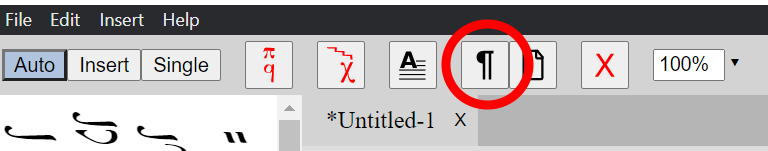

A small symbol will appear above the neume to indicate the break.

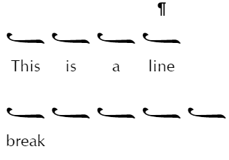

### Page Break

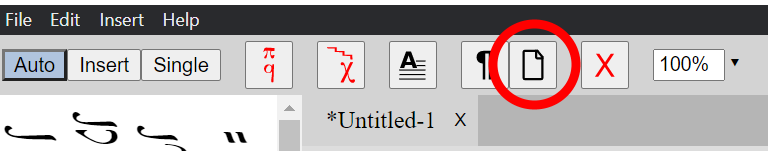

A small symbol will appear above the neume to indicate the break.

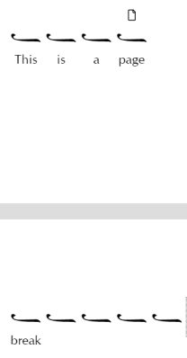

## Drop Caps

Drop Caps may be inserted through the main menu by clicking `Insert -> Drop Cap`, or by pressing the `Drop Caps` button in the main toolbar, or by pressing <kbd>Ctrl</kbd>+<kbd>D</kbd>.

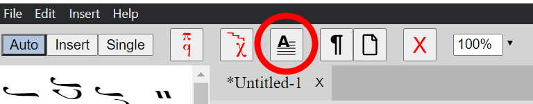

Edit the drop cap by typing the desired letter.

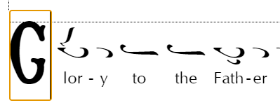

## Saving the score

To save your file to the disk, click `File -> Save` or `File -> Save As` in the main menu. The main file extension is `.byz`. It is a compressed format that reduces the file size. There is another extension, `.byzx`, which is an uncompressed file. It is mainly used for development and debugging.

## Export to PDF

To export the score to PDF, click `File -> Export to PDF` in the main menu.

## Print

To print, click `File -> Print` in the main menu.

## Page Setup

To open the page setup dialog, click `File -> Page Setup` in the main menu. This dialog allows you to customize many details about the page.

Most of the options are self-explanatory, but a few are not.

### Spacing

#### Neume Spacing

The amount of extra space that is inserted between neumes. Some scores look better with more or less spacing.

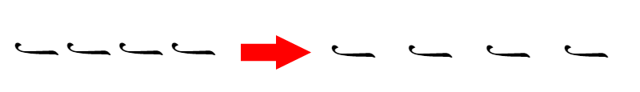

#### Lyrics: Distance Below Neumes

The vertical distance between the neumes and lyrics. This number can be negative, in which case the lyrics will be drawn closer to the neumes than they would be by default.

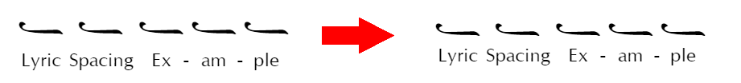

#### Lyrics: Minimum Distance Between Adjacent Lyrics

The minimum horizontal distance between the lyrics of two different notes.

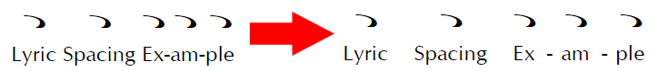

#### Line Spacing

Increasing this number will increase the space between lines.

#### Hyphen Spacing

The amount of space between the hyphens that are automatically drawn between melismatic syllables. To draw more hyphens between syllables, decrease this number. To draw less hyphens between syllables, increase this number.

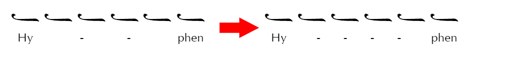

### Fonts

The default font is Source Serif, which supports the Adobe Latin-4 character set, as well as Cyrillic and Greek writing systems. GFS Didot is bundled for use with Greek texts, and Noto Naskh Arabic is bundled for use with Arabic texts.

## Audio Playback

To play a score, use the playback panel in the main toolbar.

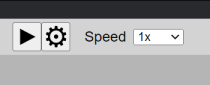

Press the `Play` button to start the audio playback. Press the button again to pause. Playback may also be started and stopped by pressing <kbd>Space</kbd> on the keyboard.

While the audio is playing, the screen will automatically scroll to the position of the current note. If you click another note, playback will jump to that note.

The `Speed` dropdown may be used to play the score at a slower or faster rate than the tempos specified in the score.

### Playback Settings

To configure the playback options, press the `Gear` button to open the `Playback Settings` dialog. An explanation of the settings is below.

#### Detune

The audio playback uses Di (Δι) as the reference note. The pitch of every note is calculated relative to the pitch of Di. By default, the pitch is set to 196 Hz, which corresponds to G3 (the G note below Middle C) using the A440 tuning standard.

You may adjust the pitch of this note to be higher or lower, which raises or lowers the pitch of the entire composition. The detune value is measured in cents, where `100 cents = 6 moria = one semitone`.

#### Volume

Use the volume sliders to adjust the volume of the melody and the ison. The volume is measured in decibels (dB), which is a logarithmic scale. The maximum value is `0 dB`, which corresponds to playing at your speaker's volume setting. The minimum value is `-Infinity`, which corresponds to muting the volume. `-10 dB` is approximately "half as loud" as `0 dB`.

#### Diatonic Zo Attraction

If checked, hymns that use the diatonic scale will automatically have the note Zo' lowered if the melody does not ascend past Zo', and the note does not already have a sharp, flat, or fthora explicitly specified. You may adjust the number of moria to lower Zo'.

This setting may be temporarily overridden for a particular note by checking the `Ignore Attractions` checkbox in the bottom toolbar. This is helpful when the software incorrectly guesses that you want the Zo flattened. By checking `Ignore Attractions`, the note will be natural unless you explictly place an alteration on the it.

It may also be overridden for an entire hymn by clicking on the mode key and checking the `Ignore Attractions` checkbox in the bottom toolbar. This is useful for hymns of the plagal first mode from Ke, which are sometimes sung as if from Pa, but without the proper Pa fthora placed above Ke.

#### Classic Legetos

If checked, hymns in the fourth mode with base notes Pa or Vou will use the classic legetos scale with Vou lowered so that the interval Vou - Di is larger than it is in the standard diatonic scale.

Below is an [example](/neanes/assets/media/Legetos_Example_1__Father_Dositheos_Katounakiotis_Kekragarion.20055d92.mp3) of Father Dositheos Katounakiotis chanting the Kekragarion in the legetos mode.

<audio controls>
  <source src="./music/Legetos_Example_1__Father_Dositheos_Katounakiotis_Kekragarion.mp3" type="audio/mpeg">
Your browser does not support the audio element.
</audio>

#### Intervals

In this section, you may specify the intervals for each scale, measured in moria. The enharmonic scale is not alterable, since it is always assumed to be a `12-12-6` tetrachord.

If the length of a tetrachord does not add up to 30 moria, then a warning will be displayed. This is because a tetrachord traditionally always spans a perfect fourth. You may ignore the warning if you wish.

#### Alteration Multipliers (Chrysanthine)

When **Use Chrysanthine Accidentals** is checked in **Page Setup**, the amount that each alteration changes the pitch is proportional to the interval between it and the next note. In this section, you may change the multipliers for these alterations.

#### Alteration Moria (1881 Committee)

In this section, you may specify the size in moria of the sharp and flat alterations.

### Tempo

Tempo is measured in beats per minute (BPM) and can be set via the `BPM` property on the following elements.

- Mode keys
- Tempo signs
- Martyria with tempo signs above them

The property is found in the bottom toolbar when the element is selected.

You may configure the default tempos for each tempo sign in the `Preferences` dialog, which can be opened from the file menu by going to `Edit -> Preferences`.

### Other Playback Settings

#### Permanent Enharmonic Zo

It is common to write hymns of the third mode and the grave mode without the proper fthores and alterations on Zo. In order to get the correct playback with a flattened Zo, click the mode key and check `Permanant Enharmonic Zo`. This will make all Zo notes enharmonic, even if not specified.

#### Chromatic Fthora Note

Chromatic fthoras are sometimes ambiguous. Use the `Chromatic Fthora` dropdown in the bottom toolbar to specify the correct note for audio playback. This selection will also determine the note indicator that appears above the note, if the note indicator has been enabled for that note.

