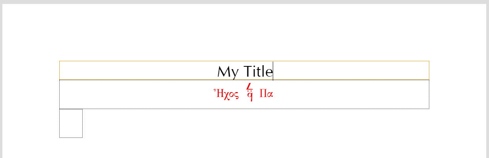
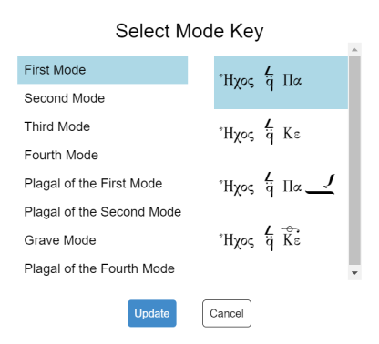
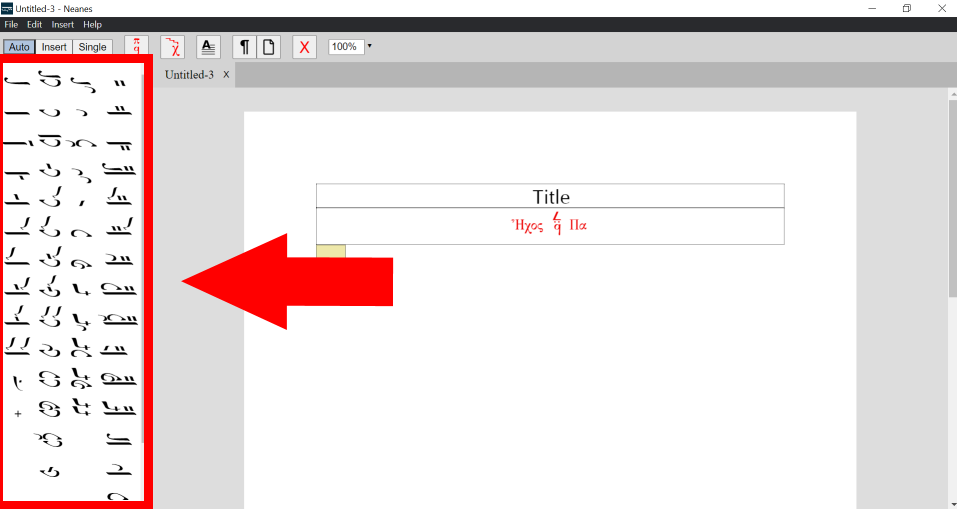
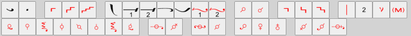
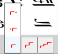

# Quick Start

This guide covers the Neanes desktop app. In this short tutorial, you will create a score, enter a few neumes and lyrics, and export the result as a PDF. Neanes starts in **Auto** entry mode, which is the easiest mode to use for a new score.

## 1. Create a score

Choose `File > New`. A new score contains a title and an initial martyria.

## 2. Name it

Click the title and type.

The bottom toolbar supplies common text controls. Select the title and open `View > Properties` for its full settings.

## 3. Choose the initial martyria

Double-click the initial martyria, right-click it and choose `Change Initial Martyria`, or select it and use the Change Initial Martyria button in the toolbar at the bottom of the window. Choose a mode on the left and an initial martyria on the right.

## 4. Add three neumes

In the Neume Selector pane, click a quantitative neume. In Auto mode, the neume is entered and the cursor moves to the next position. Add two more neumes the same way.

To add a supporting sign, such as a gorgon, fthora, or accidental, select a neume and use the toolbar at the bottom of the window. Supporting signs change the selected neume without moving the cursor. Some buttons offer more choices when you click and hold them.

## 5. Add lyrics

Click beneath the first neume and type a syllable. Press <kbd>Space</kbd> or <kbd>Tab</kbd> to move to the next neume. To type an actual space without advancing, press <kbd>Ctrl</kbd>/<kbd>Cmd</kbd>+<kbd>Space</kbd>.

If the syllable continues over several neumes, end it with `_` or `-`. The [Lyrics guide](/guide/lyrics.html) explains melismata and Greek lyric entry in detail.

## 6. Save and export

Use `File > Save` to save the editable score. Then choose `File > Export > Export as PDF` to create a PDF. Use `File > Print` if you want to print directly.

## Where to go next

- [Learn the editor](/guide/editor-basics.html), including selection, panes, and entry modes.
- [Write music](/guide/writing-music.html), including martyriæ, supporting signs, and line control.
- [Work with lyrics](/guide/lyrics.html), including the Lyrics pane and prosomoia.
- [Add text, images, and paragraph styles](/guide/text-and-styles.html).
- [Set up pages](/guide/page-layout.html) and [choose file formats](/guide/saving-and-exporting.html).
- [Configure playback](/guide/playback.html) or explore [advanced workflows](/guide/advanced.html).
