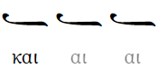
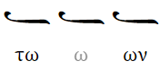
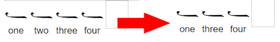
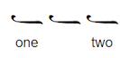
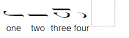
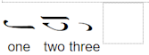
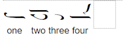
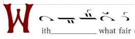

# Lyrics

You can enter lyrics directly beneath the neumes or edit a whole passage in the Lyrics pane. Direct entry is convenient while writing a score. The Lyrics pane is better for replacing text, shifting syllables, or preparing a prosomoion.

## Enter lyrics directly

Click beneath a neume and type. The following keys help you move between the neumes and their lyrics:

- Press <kbd>Space</kbd>, <kbd>Tab</kbd>, or <kbd>Ctrl</kbd>/<kbd>Cmd</kbd>+<kbd>Right Arrow</kbd> to move to the next lyric box.
- Press <kbd>Ctrl</kbd>/<kbd>Cmd</kbd>+<kbd>Left Arrow</kbd> to move to the previous lyric box.
- Press <kbd>Ctrl</kbd>/<kbd>Cmd</kbd>+<kbd>Space</kbd> to enter an actual space.
- At the beginning or end of a lyric box, the left and right arrow keys move to the neighboring box.
- Press <kbd>Ctrl</kbd>/<kbd>Cmd</kbd>+<kbd>Down Arrow</kbd> to move from a neume to its lyrics.
- Press <kbd>Ctrl</kbd>/<kbd>Cmd</kbd>+<kbd>Up Arrow</kbd> to return to the neume.

## Make a melisma

End a lyric with an underscore or hyphen (`_` or `-`) to start a melisma. Enter a single underscore or hyphen beneath each following neume that continues the syllable. Neanes draws the melisma for you.

To type `_` or `-` without advancing to the next lyric box, hold <kbd>Ctrl</kbd> on Windows or Linux, or <kbd>Option</kbd> on macOS.

### Greek melismata

For a Greek syllable that ends in a vowel, use an underscore to continue its final vowel or vowels. The repeated vowels appear lighter than the original lyric.

For example, enter <kbd>και\_</kbd> <kbd>\_</kbd> <kbd>\_</kbd>:



For a syllable that ends in a consonant, use a hyphen to continue the vowel inside the syllable. For example, enter <kbd>τω-</kbd> <kbd>-</kbd> <kbd>ων</kbd>:



The distinction matters in the Lyrics pane even though the two melismata look alike in the score. `τω_ _ ων` is interpreted as two words, `τω ων`, while the hyphenated form remains one syllable.

To use the non-Greek behavior instead, enable `Disable Greek Melismata` in `File > Page Setup`.

## Edit lyrics in the Lyrics pane

Choose `View > Lyrics` or press <kbd>Ctrl</kbd>/<kbd>Cmd</kbd>+<kbd>L</kbd>. The pane shows the score's lyrics as editable text. Changes in the pane are assigned back to the neumes, and changes made beneath individual neumes are reflected in the pane.

This is a quick way to replace a passage or shift lyrics left or right without opening every lyric box.



When lyrics are not locked, they belong to their neumes. If you delete the neume carrying `two`, the pane changes from:

```text
one two three four
```

to:

```text
one three four
```

### Leave a neume blank

Use a single underscore as a placeholder when a neume should receive no lyric:

```text
one _ two
```



## Lock lyrics while editing the melody

Enable `Lock Lyrics` in the Lyrics pane when you want the text to remain fixed while adding or removing neumes. While lyrics are locked, edit the text in the pane rather than beneath individual neumes.

Suppose four neumes have these lyrics:

```text
one two three four
```



If you delete the second neume, the text remains unchanged. Neanes assigns the four lyrics to the three remaining neumes as far as it can:



If you add a fourth neume, it receives `four`:



## Choose which neumes receive lyrics

Select a neume and open `View > Properties`. The `Accepts Lyrics` setting controls how the Lyrics pane treats that neume.

| Value        | Meaning                                                                                                       |
| ------------ | ------------------------------------------------------------------------------------------------------------- |
| Default      | Uses the neume's normal behavior. For example, rests do not receive lyrics by default.                        |
| Yes          | Always assigns an ordinary lyric to the neume.                                                                |
| No           | Never assigns a lyric to the neume.                                                                           |
| Melisma Only | Assigns only a melisma continuation, represented by a hyphen or underscore, rather than an ordinary syllable. |

`Melisma Only` is especially useful in templates. It lets the Lyrics pane skip the continuation neumes automatically, so replacement text does not need to contain a run of underscores or hyphens.



With every neume set to `Default`, you must write the continuations explicitly:

```text
With___ what fair
```

If the second and third neumes are set to `Melisma Only`, you can write:

```text
With what fair
```

Neanes supplies the continuations on those two neumes.

Choose `Save Current Melismas` in the Lyrics pane to set `Accepts Lyrics` throughout the score from the lyrics that are already present. Neumes currently carrying a melisma become `Melisma Only`; the other neumes return to `Default`.

## Create a prosomoion from an automelon

A prosomoion uses the melodic pattern of an automelon with different words. Neanes can preserve the automelon's syllable and melisma pattern while you replace its text.

### Prepare the template

1. Create the automelon with its melody and original lyrics.
2. Open the Lyrics pane and choose `Save Current Melismas`. This records which neumes carry syllables and which carry only melisma continuations.
3. Enable `Lock Lyrics`.
4. Save the score as your template.

Keep the original template unchanged. Make a copy whenever you want to create a new prosomoion.

### Prepare the new text

For languages that use written syllable breaks, hyphenate the new text before pasting it. For example:

```text
With what fair crowns of praise shall we crown the di-vine and all-laud-a-ble hier-arch?
```

Paste the text into the Lyrics pane. Neanes assigns each syllable to the neumes that accept ordinary lyrics and fills the `Melisma Only` positions automatically.

The new text may not match the automelon's pattern perfectly. After pasting, check the score and adjust individual lyric assignments where necessary.

### Use Greek text

Greek text normally uses spaces rather than written hyphens between syllables. Separate the syllables with single spaces and use underscores for melismata. If a syllable ends in a consonant, place the underscore at the end of that syllable.

For example, `των___` is interpreted as one syllable followed by three melisma continuations:


You can compare the result with the project's example: [editable BYZX](https://github.com/neanes/neanes/blob/master/examples/English%20-%20Prosomia%20-%20With%20What%20Fair%20Crowns.byzx) and [PDF](https://github.com/neanes/neanes/blob/master/examples/English%20-%20Prosomia%20-%20With%20What%20Fair%20Crowns.pdf).
