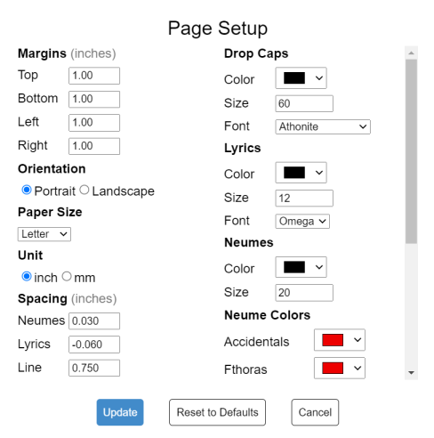

# Page Layout and Books

## Set up a page

Open `File > Page Setup` to set page size, margins, fonts, spacing, and book-layout options.

The spacing controls affect layout as follows:

- **Neume spacing** adds horizontal space between neumes.
- **Lyrics distance below neumes** changes the vertical separation and may be negative.
- **Minimum distance between adjacent lyrics** sets the horizontal minimum.
- **Line spacing** increases the space between rendered lines.
- **Hyphen spacing** changes how many automatically drawn melisma hyphens fit between syllables.

### See how spacing settings affect the score

**Neume spacing** adds horizontal space between neumes:

**Lyrics distance below neumes** changes the vertical distance between lyrics and neumes. It can be negative:

**Minimum distance between adjacent lyrics** keeps neighboring syllables apart:

**Line spacing** changes the distance between systems:

**Hyphen spacing** controls how closely the automatically drawn hyphens are placed. Decrease the value to draw more hyphens and increase it to draw fewer:

## Choose text fonts

Neanes includes fonts for several writing systems. Source Serif and Old Standard cover Latin, Cyrillic, and Greek text. GFS Didot is included for Greek, and Noto Naskh Arabic is included for Arabic. Paragraph styles are the easiest way to use the same font consistently for titles, lyrics, and other repeated text.

## Use facing pages

Enable facing pages for a book-style layout with inside and outside margins.

Odd and even layouts follow the displayed page number, not the page's position in the file. If the first displayed page number is 2, the first page is treated as even.

- In a left-to-right score, odd displayed pages are right-hand pages.
- In a right-to-left score, even displayed pages are right-hand pages.
- When facing pages are disabled, every page uses the right-hand page layout.

## Add headers and footers

Use `Insert > Headers and Footers > Header` or `Footer`. Page Setup controls whether headers and footers are shown and whether the first, odd and even, or chapter-opening pages use different content.

Each header and footer has left, center, and right content areas. For example, a book can place its page numbers at the outside edge and its chapter title toward the center.

### Header and footer variants

| Variant         | Used when                                                                                  |
| --------------- | ------------------------------------------------------------------------------------------ |
| Default         | No more specific variant applies                                                           |
| First page      | `Different first page` is enabled and this is the first page                               |
| Odd             | `Different odd and even` is enabled and the displayed page number is odd                   |
| Even            | `Different odd and even` is enabled and the displayed page number is even                  |
| Chapter opening | `Different chapter opening` is enabled and a new chapter running marker begins on the page |

Neanes chooses one header variant and one footer variant for each page. When more than one variant could apply, the order is:

1. First page
2. Chapter opening
3. Odd or even
4. Default

For example, the first-page variant wins when the first page also begins a chapter. A chapter-opening variant wins over the odd or even variant.

### Insert page and document information

Type the following tokens in a header or footer. Neanes replaces them on screen and when printing or exporting.

| Token       | Inserts                                  |
| ----------- | ---------------------------------------- |
| `$p`        | Displayed page number                    |
| `$n`        | Displayed number of the final page       |
| `$f`        | File name without its extension          |
| `$F`        | Full file path                           |
| `$:author`  | Author from `File > Document Properties` |
| `$:title`   | Title from `File > Document Properties`  |
| `$:chapter` | Current chapter running marker           |
| `$:section` | Current section running marker           |

If a value has not been set, its token produces no text.

To add a page number, type `$p` in the desired content area:

Page-number tokens respect `First page number`. If a ten-page score begins at displayed page 3, `$p` shows `3` on its first page and `$n` shows `12`. When Eastern Arabic page numbers are enabled, the tokens use Eastern Arabic digits.

Use `File > Document Properties` to set the document-wide title and author used by `$:title` and `$:author`.

## Running chapter and section titles

A running marker lets a header or footer display a chapter or section title taken from the score body.

1. Select a text box or rich text box in the score body.
2. Open `View > Properties`.
3. Set `Running Marker Role` to `Chapter` or `Section`.
4. If the header should use different wording, enter it in `Running Marker Text`. Otherwise Neanes uses the visible text of the box.

The Chapter and Section paragraph styles are a convenient way to format these headings, but the style does not create a running marker by itself.

On each page, the first marker of each role becomes the value for that page. A page without a new marker keeps the value from the preceding page. When a new chapter begins, the previous section is cleared unless the same page also contains a new section marker.

For example, if page 4 contains a chapter marker whose text is `Matins`, `$:chapter` displays `Matins` on page 4 and following pages until another chapter marker appears.

Headers and footers can display running markers, but text inside a header or footer does not define a new marker.

### Chapter-opening pages

A page is a chapter opening when its first Chapter running marker differs from the chapter already in effect. Repeating the same marker later does not create another chapter opening.

Moving the marker to another page can therefore change which page receives the chapter-opening header and footer. A forced page break or the layout settings determine where the heading appears; the header/footer option only chooses the variant after the chapter opening has been detected.

## Starting layouts and common patterns

New scores begin with generated header and footer content:

- Without facing pages, headers are empty and the default footer contains a centered `$p`.
- With facing pages, ordinary headers begin with a book-style layout, ordinary footers are empty, and chapter-opening footers contain a centered `$p`.

If you enable facing pages while the generated defaults are still untouched, Neanes may also enable `Different odd and even` so the generated headers continue to work as facing-page headers.

Some common arrangements are:

- **Page numbers on every page:** enable footers and place `$p` in the default footer.
- **No running head on the title page:** enable `Different first page` and leave the first-page header empty.
- **Book-style running heads:** enable facing pages and `Different odd and even`; place `$:chapter`, `$:section`, and `$p` in the odd and even headers.
- **Quiet chapter openings:** enable `Different chapter opening`, leave that header empty, and keep `$p` in its footer.

## Limits and details to remember

- Changing `First page number` can change which pages use the odd and even variants.
- Moving a Chapter marker can change where a chapter-opening variant is used.
- Header and footer variants apply to the whole score; separate document sections cannot have completely independent sets.
- Tokens are simple placeholders and do not support conditional logic.
