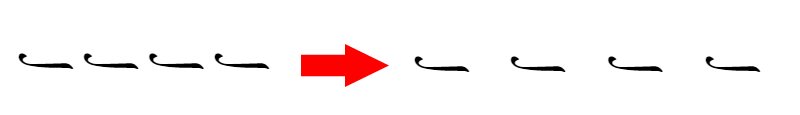
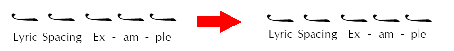
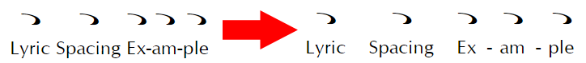
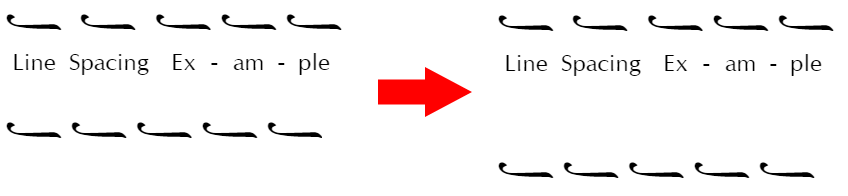
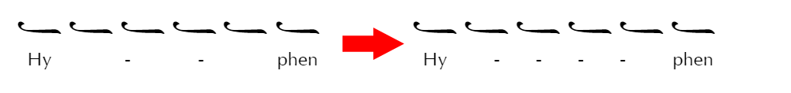
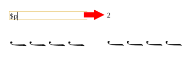

# Page Layout and Books

Page Setup controls the layout, notation behavior, and default appearance of the current score. Choose `File > Page Setup` to open it.

Use Page Setup when a change should apply throughout the score. For an exception that affects only one selected element, use the Properties pane instead.

The preview at the bottom of Page Setup shows neume styling and some spacing changes in a short passage. It is not a preview of the complete page, margins, headers, or footers. The buttons at the bottom determine where the displayed settings are used:

| If you want to...                                     | Choose...              |
| ----------------------------------------------------- | ---------------------- |
| Apply the settings to the open score                  | **Update**             |
| Use the settings as the starting point for new scores | **Set as Default**     |
| Restore the supplied settings in the dialog           | **Use System Default** |
| Close the dialog without applying its settings        | **Cancel**             |

**Set as Default** does not change the open score. **Use System Default** only changes the settings displayed in the dialog. To change both the open score and the defaults for new scores, choose **Set as Default**, then **Update**.

## Choose the page size and margins

Use **Page Size** to choose a standard paper size or enter custom dimensions. You can also choose portrait or landscape orientation and the unit used for page dimensions, margins, and spacing.

Use **Margins** to set the space around the score. The Header and Footer margins position those areas relative to the page edges; they do not turn headers or footers on.

Before printing or exporting a PDF, choose the paper size and orientation you intend to use. A change to either can reflow the score and produce different line and page breaks.

### Use facing pages

Enable **Facing Pages** for a book-style layout. The Left and Right margins become Inside and Outside margins, and **Binding Direction** determines how odd and even pages are arranged.

Odd and even layouts follow the displayed page number, not the page's position in the file. If the first displayed page number is 2, the first page is treated as even.

- In a left-to-right score, odd displayed pages are right-hand pages.
- In a right-to-left score, even displayed pages are right-hand pages.
- When facing pages are disabled, every page uses the right-hand page layout.

## Adjust spacing throughout the score

Use **Spacing** to correct a problem that occurs repeatedly. For one isolated collision or gap, use the selected element's Properties or positioning controls instead.

- **Neume Spacing** changes the preferred horizontal space between neumes.
- **Martyria: Vertical Offset** moves all martyriæ vertically in relation to the neumes.
- **Lyrics: Distance Below Neumes** changes the vertical separation between neumes and lyrics.
- **Lyrics: Minimum Distance Between Adjacent Lyrics** keeps neighboring syllables apart.
- **Lyrics: Hyphen Spacing** changes how closely automatic melisma hyphens are placed.
- **Lyrics: Syllable-Hyphen Clearance** keeps the nearest hyphen away from each syllable.
- **Line Spacing** sets the minimum space between rendered lines. Neanes may use more space to prevent collisions between adjacent lines.

### See how spacing settings affect the score

Increasing **Neume Spacing** creates a more open score:

**Lyrics: Distance Below Neumes** may be negative. Increasing it lowers the lyrics:

Increasing **Lyrics: Minimum Distance Between Adjacent Lyrics** adds room between neighboring syllables:

Increasing **Line Spacing** adds room between systems:

Decrease **Lyrics: Hyphen Spacing** to draw more hyphens between syllables, or increase it to draw fewer:

## Control lyric layout

Use **Lyrics** for score-wide details that are not controlled by the Lyrics paragraph style:

- **Melisma Cutoff** hides melisma lines shorter than the selected width. This can prevent a very short line from looking like punctuation. Set a large value if you do not want melisma lines to appear.
- **Ignore Punctuation When Positioning Lyrics** centers the sung portion of a syllable while disregarding surrounding punctuation such as quotation marks, commas, and periods.

Neanes automatically uses Greek melismatic conventions when it recognizes Greek text. To use the non-Greek behavior instead, enable **Disable Greek Melismata** under **Miscellaneous**. This can also be useful for another language written in Greek script.

See [Lyrics](/guide/lyrics.html) for entering syllables, creating melismata, and editing an entire passage in the Lyrics pane.

## Choose notation behavior

The **Miscellaneous** section contains score-wide notation and layout choices:

- **Disable Fthora Restrictions** allows a fthora to be placed on any note. Use this for exceptional or nontraditional notation that the normal placement rules do not permit.
- **Align Ison Indicators** places the ison indicators on each line at a common height.
- **Melkite RTL** lays out the music from right to left and uses the specialized RTL neume font for Melkite scores in Arabic.
- **Disable Greek Melismata** prevents Neanes from applying the Greek melismatic convention automatically.

### Choose how accidentals are interpreted

Byzantine accidentals can be interpreted using either of two systems. Chrysanthos's system determines an accidental's effect in proportion to the next interval, while the system formalized by the Patriarchal Committee of 1881 assigns each accidental a fixed value. Neanes supports both systems.

Enable **Use Chrysanthine Accidentals** when accidentals should follow Chrysanthos's proportional system. Their effect then depends on the interval between the altered note and the next note in the scale. For example, a plain sharp raises a note halfway toward the next scale note. It raises the pitch by 6 moria, or 100 cents, when the next interval is 12 moria; when the interval is 10 moria, it raises the pitch by 5 moria, or about 83 cents.

Disable **Use Chrysanthine Accidentals** to use the fixed values of the 1881 Committee system. In that system, a plain sharp raises a note by 2 moria, and each additional crossbeam adds another 2 moria. Flats follow the same fixed steps downward.

This setting affects playback and MusicXML export; it does not change how an accidental looks in the score. Under **Alterations** in Playback Settings, you can change the proportional Chrysanthine multipliers and the fixed 1881 Committee values. See [Accidentals](/guide/playback.html#accidentals) for the related playback controls.

## Set the score's appearance

The appearance sections in Page Setup establish consistent score-wide styles. Use the Properties pane or positioning controls when one element needs to differ. Some controls, such as the drop-cap line span, provide the starting value for newly inserted elements instead.

### Style neumes and alternate lines

Use **Neumes** to choose the default color, size, font, and outline for the score's neumes. The same section sets the color and size of alternate musical lines.

Use **Neume Styles** when a particular class of sign should differ from the base neume style. Available classes include accidentals, fthoræ, gorgons, heterons, ison indicators, martyriæ, tempo signs, measure bars and numbers, note indicators, breath marks, crosses, and koronides.

Each class can have its own color and outline. To give several classes the same color:

1. Select the checkboxes beside the desired classes.
2. Choose a color under **Change Color of Multiple Neumes**.
3. Choose **Apply Color**.

The preview helps compare the specialized colors with the principal neume color before you update the score.

### Style initial martyriæ

Use **Initial Martyriæ** to set their default color, size, outline, and height adjustment. **Height Adjustment** adds or removes vertical space occupied by initial martyriæ. Use it when the following music sits too close to or too far from them.

For the musical content or playback behavior of one initial martyria, select it in the score and use its bottom toolbar or Properties.

### Set the drop-cap span

Use **Drop Caps** to set **Lines to Drop**, the initial line span for newly inserted drop caps. To change an existing drop cap, select it and change **Lines to Drop** in Properties.

You can change the appearance of drop caps through the built-in Drop Cap paragraph style. See [Text, Images, and Paragraph Styles](/guide/text-and-styles.html#use-paragraph-styles).

### Choose text fonts

Text fonts are controlled by paragraph styles rather than Page Setup. Neanes includes fonts for several writing systems: Source Serif and Old Standard cover Latin, Cyrillic, and Greek; GFS Didot is included for Greek; and Noto Naskh Arabic is included for Arabic.

Modify the built-in styles when titles, lyrics, headers, footers, and other repeated text should use a consistent font.

## Add headers and footers

Use `Insert > Headers and Footers > Header` or `Footer` to edit their contents. In the **Headers and Footers** section of Page Setup, enable **Include Header** or **Include Footer** to display them.

Each header and footer has left, center, and right content areas. For example, a book can place its page numbers at the outside edge and its chapter title toward the center. Enable **Use Rich Text** when those areas need rich formatting rather than the simple text editor.

Choose the header and footer editor type before entering custom content. Changing **Use Rich Text** replaces the existing header and footer contents with generated templates. If you switch it accidentally, use Undo to restore the previous contents.

### Header and footer variants

Page Setup can provide different content for the first page, odd and even pages, and chapter-opening pages.

| Variant         | Used when                                                                                    |
| --------------- | -------------------------------------------------------------------------------------------- |
| Default         | No more specific variant applies                                                             |
| First page      | **Different First Page** is enabled and this is the first page                               |
| Odd             | **Different Odd and Even** is enabled and the displayed page number is odd                   |
| Even            | **Different Odd and Even** is enabled and the displayed page number is even                  |
| Chapter opening | **Different Chapter Opening** is enabled and a new Chapter running marker begins on the page |

Neanes chooses one header variant and one footer variant for each page. When more than one variant could apply, the order is:

1. First page
2. Chapter opening
3. Odd or even
4. Default

For example, the first-page variant wins when the first page also begins a chapter. A chapter-opening variant wins over the odd or even variant.

### Insert page and document information

Type the following tokens in a header or footer. Neanes replaces them on screen and when printing or exporting.

| Token       | Inserts                                  |
| ----------- | ---------------------------------------- |
| `$p`        | Displayed page number                    |
| `$n`        | Displayed number of the final page       |
| `$f`        | File name without its extension          |
| `$F`        | Full file path                           |
| `$:author`  | Author from `File > Document Properties` |
| `$:title`   | Title from `File > Document Properties`  |
| `$:chapter` | Current Chapter running marker           |
| `$:section` | Current Section running marker           |

If a value has not been set, its token produces no text.

To add a page number, type `$p` in the desired content area:

Page-number tokens respect **First Page Number**. If a ten-page score begins at displayed page 3, `$p` shows `3` on its first page and `$n` shows `12`. Use **Numerals** to choose Western Arabic digits (`0, 1, 2`) or Eastern Arabic digits (`٠, ١, ٢`).

Use `File > Document Properties` to set the document-wide title and author used by `$:title` and `$:author`.

### Add horizontal rules

Enable **Header Rule** to draw a line below the header or **Footer Rule** to draw one above the footer. You can set each rule's color, thickness, and gaps above and below it.

Rules can be hidden independently on first, chapter-opening, odd, or even pages. The corresponding page variant must be enabled before its exclusion option is available.

## Use running chapter and section titles

A running marker lets a header or footer display a chapter or section title taken from the score body.

1. Select a text box or rich text box in the score body.
2. Open `View > Properties`.
3. Set **Running Marker Role** to **Chapter** or **Section**.
4. If the header should use different wording, enter it in **Running Marker Text**. Otherwise, Neanes uses the visible text of the box.

The Chapter and Section paragraph styles are a convenient way to format these headings, but the style does not create a running marker by itself.

On each page, the first marker of each role becomes the value for that page. A page without a new marker keeps the value from the preceding page. When a new chapter begins, the previous section is cleared unless the same page also contains a new section marker.

For example, if page 4 contains a Chapter marker whose text is `Matins`, `$:chapter` displays `Matins` on page 4 and following pages until another Chapter marker appears.

Headers and footers can display running markers, but text inside a header or footer does not define a new marker.

### Chapter-opening pages

A page is a chapter opening when its first Chapter running marker differs from the chapter already in effect. Repeating the same marker later does not create another chapter opening.

Moving the marker to another page can therefore change which page receives the chapter-opening header and footer. A forced page break or the layout settings determine where the heading appears; the header/footer option only chooses the variant after the chapter opening has been detected.

## Start with a common page layout

New scores begin with generated header and footer content:

- Without facing pages, headers are empty and the default footer contains a centered `$p`.
- With facing pages, ordinary headers begin with a book-style layout, ordinary footers are empty, and chapter-opening footers contain a centered `$p`.

If you enable facing pages while the generated defaults are still untouched, Neanes may also enable **Different Odd and Even** so the generated headers continue to work as facing-page headers.

Some common arrangements are:

- **Page numbers on every page:** Enable footers and place `$p` in the default footer.
- **No running head on the title page:** Enable **Different First Page** and leave the first-page header empty.
- **Book-style running heads:** Enable facing pages and **Different Odd and Even**; place `$:chapter`, `$:section`, and `$p` in the odd and even headers.
- **Quiet chapter openings:** Enable **Different Chapter Opening**, leave that header empty, and keep `$p` in its footer.
- **Traditional black and red notation:** Set the principal neume color under **Neumes**, then use **Neume Styles** for the classes that should be red.
- **Right-to-left Melkite score:** Enable **Melkite RTL**, then enable facing pages and choose the appropriate binding direction if the score will be bound as a book.

## Troubleshoot page layout

- For a problem repeated throughout the score, begin with Page Setup.
- For one isolated element, use Properties or the element's positioning controls.
- Check the page size, orientation, and margins before adding forced line or page breaks.
- Remember that **First Page Number** can change which pages use the odd and even variants.
- Moving a Chapter marker can change where the chapter-opening variant is used.
- Header and footer variants apply to the whole score; separate document sections cannot have independent sets.
- Header and footer tokens are simple placeholders and do not support conditional logic.

See [Control line and page breaks](/guide/writing-music.html#control-line-and-page-breaks) when the page setup is correct but a particular passage should break at a chosen point.
