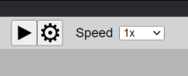

# Playback

## Play and navigate

Use the playback panel in the main toolbar. Choose Play to start and choose it again to pause. You can also press <kbd>Space</kbd>.

During playback, the editor follows the current note. Select another note to continue from that position. The Speed control plays the whole score more slowly or quickly without changing its written tempo signs.

## Adjust the sound

Choose the gear control in the playback panel to open Playback Settings.

### Reference pitch and detune

Playback uses Di as its reference pitch. By default, Di is 196 Hz, corresponding to G3 in A440 tuning. Detune raises or lowers the entire composition in cents; 100 cents equals 6 moria, or one equal-tempered semitone.

### Melody and ison volume

The melody and ison have separate volume controls. Volume is shown in decibels. `0 dB` uses the full output level, while `-Infinity` mutes that part. Because decibels are logarithmic, `-10 dB` sounds roughly half as loud as `0 dB`.

### Diatonic Zo Attraction

When this option is enabled, Neanes lowers Zo' in a diatonic melody that does not ascend beyond Zo', unless an accidental or fthora already determines the note.

If one note should remain natural, select it and enable `Ignore Attractions` in Properties. To disable the attraction for a whole hymn, select its initial martyria and enable the same setting there.

### Classic Legetos

When Classic Legetos is enabled, fourth-mode hymns from Pa or Vou use the classic legetos scale, with Vou lowered to enlarge the interval from Vou to Di.

The following recording is an example of Father Dositheos Katounakiotis chanting the Kekragarion in legetos mode:

<audio controls>
  <source src="./music/Legetos_Example_1__Father_Dositheos_Katounakiotis_Kekragarion.mp3" type="audio/mpeg">
Your browser does not support the audio element.
</audio>

## Playback tuning reference

### Scale intervals

The Intervals section sets the intervals of each scale in moria. The enharmonic scale is fixed at a `12-12-6` tetrachord. Neanes warns when an editable tetrachord does not total 30 moria, because a tetrachord traditionally spans a perfect fourth. You can still keep the values when the departure is intentional.

### Accidentals

When `Use Chrysanthine Accidentals` is enabled in Page Setup, each alteration is calculated as a proportion of the following interval. The Chrysanthine section controls those multipliers.

Otherwise, the 1881 Committee section sets the direct number of moria used by each sharp and flat.

These settings determine pitch during playback. Page Setup separately controls how accidentals are drawn.

### Tempo

Set BPM in Properties for an initial martyria, a tempo sign, or a martyria carrying a tempo sign. Playback uses the new BPM when it reaches that element.

Choose `Edit > Preferences` to set the default BPM for each tempo sign. A BPM entered on an individual element takes precedence over that default.

### Permanent Enharmonic Zo

Third-mode and grave-mode scores sometimes omit the fthoræ and alterations that would explicitly flatten Zo. Select the initial martyria and enable `Permanent Enharmonic Zo` when the whole hymn should use the enharmonic Zo.

### Chromatic Fthora Note

A chromatic fthora can be ambiguous. Select it and use `Fthora Note` in Properties to identify its note. Neanes uses this choice for playback and for a note indicator when one is enabled.
