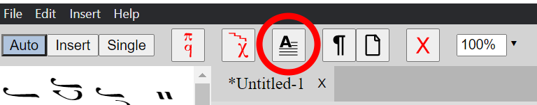
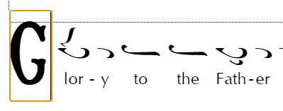

# Text, Images, and Styles

## Insert text and images

The `Insert` menu provides several ways to add material besides notes:

- **Text Box** is suitable for short, simply formatted text.
- **Rich Text Box** supports several paragraphs, links, lists, horizontal rules, images, and inserted neumes.
- **Inline Text Box** sits in the musical flow and can align with either the neumes or the lyrics.
- **Image** adds an image from your computer.
- **Annotation** and **Alternate Line** attach additional material to the selected note.

Select a text element to show its formatting toolbar. The Properties pane contains its complete layout and formatting options.

Use `Insert > Drop Cap Before` or `Insert > Drop Cap After` to add a drop cap, then type its letter. The shortcut is <kbd>Ctrl</kbd>/<kbd>Cmd</kbd>+<kbd>D</kbd> for before and <kbd>Ctrl</kbd>/<kbd>Cmd</kbd>+<kbd>Shift</kbd>+<kbd>D</kbd> for after.

## Format rich text

Use the rich-text toolbar to change the selected text or the paragraph containing the cursor.

### Link to another place in the score

You can create a link that jumps to a score element in an exported PDF:

1. Select the destination element.
2. Choose `Edit > Copy Element Link`.
3. Select the text that should become the link.
4. Choose the link control in the rich-text toolbar and paste the copied value into `Link URL`.

### Add lists and horizontal lines

Use the bulleted-list or numbered-list control to create a list. Numbered lists can begin at a custom number, run in reverse, and use different numbering styles.

Use the horizontal-line control to add a divider between sections of a rich text box.

## Apply paragraph styles

Paragraph styles keep repeated text consistent. For example, if every chapter heading uses the Chapter style, you can change all chapter headings by editing that one style.

Choose a style from the contextual toolbar or Properties pane. In a rich text box, the style applies to the paragraph containing the cursor. Text boxes, lyrics, annotations, and drop caps use a style for the whole element.

| Built-in style   | Intended use                        |
| ---------------- | ----------------------------------- |
| Default Text     | text boxes and rich-text paragraphs |
| Annotation       | annotations                         |
| Title, Subtitle  | titles and subtitles                |
| Chapter, Section | chapter and section headings        |
| Header, Footer   | headers and footers                 |
| Lyrics           | note lyrics and inline text         |
| Drop Cap         | drop caps                           |

The Chapter and Section styles control appearance only. To use a heading in a running header or footer, also set its `Running Marker Role` in Properties. See [Running chapter and section titles](/guide/page-layout.html#running-chapter-and-section-titles).

## Edit paragraph styles

Choose `Format > Paragraph Styles` to change the style definitions used by the score.

- Select a built-in style to change it.
- Add a style when you need a new kind of repeated formatting.
- Duplicate an existing style to use it as a starting point.
- Reset a built-in style to restore its factory settings.
- Choose `Set as Default` if you want new scores to start with the styles currently shown in the dialog. This does not update the open score by itself.

Choose `Update` to apply the styles shown in the dialog to the open score. If you want to change both the defaults and the open score, choose `Set as Default` first and then `Update`.

### Inherit formatting from another style

Most styles have a parent. A setting with its override enabled belongs to the current style. A setting with its override disabled comes from the parent.

For example, Chapter and Section can inherit their font family from Default Text while supplying their own size, style, and alignment. Changing the Default Text font then updates both heading styles without changing their individual sizes.

### Understand local formatting

Formatting applied directly to an element takes precedence over its paragraph style. This is called a local override. It is useful for an exception, such as one red annotation, but it also means that changing the shared style will not change that particular setting on the element.

If an element does not respond to a style change, select it and check its active formatting overrides in the toolbar or Properties pane.

When you copy styled content into another score, Neanes brings along any custom paragraph styles that the content needs so that its appearance does not change.
