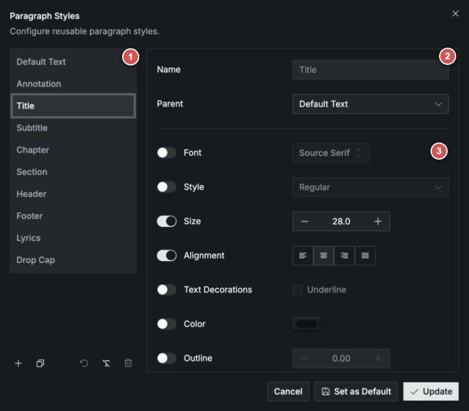

# Text, Images, and Paragraph Styles

Neanes supports simple text, rich text, images, and reusable paragraph styles. Use direct formatting for a one-off exception and paragraph styles for formatting that should remain consistent throughout a score.

## Insert text and images

The `Insert` menu provides several ways to add material besides notes:

| Element             | Best use                                                                | Formatting scope                          |
| ------------------- | ----------------------------------------------------------------------- | ----------------------------------------- |
| **Text Box**        | Short, simply formatted text                                            | The whole text box                        |
| **Rich Text Box**   | Several paragraphs, links, lists, rules, images, or inserted neumes     | Individual paragraphs and text selections |
| **Inline Text Box** | Text that sits in the musical flow and aligns with the neumes or lyrics | The whole text box                        |
| **Image**           | An image from your computer                                             | Size and position                         |
| **Annotation**      | Additional text attached to a selected note                             | The whole annotation                      |
| **Alternate Line**  | An alternate musical line attached to a selected note                   | The alternate line and its annotations    |

Select a text element to show its contextual formatting toolbar. The Properties pane contains its complete layout and formatting options.

Use `Insert > Drop Cap Before` or `Insert > Drop Cap After` to add a drop cap, then type its letter. The shortcut is <kbd>Ctrl</kbd>/<kbd>Cmd</kbd>+<kbd>D</kbd> for before and <kbd>Ctrl</kbd>/<kbd>Cmd</kbd>+<kbd>Shift</kbd>+<kbd>D</kbd> for after.

## Format rich text

Use the rich-text toolbar to change the selected text or the paragraph containing the cursor. Character formatting, such as bold or color applied to a selection, can coexist with the paragraph's style.

### Link to another place in the score

You can create a link that jumps to a score element in an exported PDF:

1. Select the destination element.
2. Choose `Edit > Copy Element Link`.
3. Select the text that should become the link.
4. Choose the link control in the rich-text toolbar and paste the copied value into `Link URL`.

### Add lists and horizontal lines

Use the bulleted-list or numbered-list control to create a list. Numbered lists can begin at a custom number, run in reverse, and use different numbering styles.

Use the horizontal-line control to add a divider between sections of a rich text box.

## Use paragraph styles

Paragraph styles help you keep repeated text consistent. For example, apply the **Chapter** style to every chapter heading. If you later change the Chapter style, all of those headings update together.

Use a paragraph style for formatting shared by several items. Use the contextual toolbar or Properties pane when only one item should look different.

### Apply a style

Select the text element, then choose a style from the contextual toolbar or Properties pane.

- In a rich text box, the style applies to the paragraph containing the cursor. You can also select several paragraphs before choosing a style.
- Text boxes, inline text boxes, lyrics, annotations, and drop caps use one style for the whole element.

The following styles are included with every score:

| Style                    | Use it for                             |
| ------------------------ | -------------------------------------- |
| **Default Text**         | Ordinary text and rich-text paragraphs |
| **Annotation**           | Annotations                            |
| **Title**, **Subtitle**  | Titles and subtitles                   |
| **Chapter**, **Section** | Chapter and section headings           |
| **Header**, **Footer**   | Headers and footers                    |
| **Lyrics**               | Note lyrics and inline text            |
| **Drop Cap**             | Drop caps                              |

You can change the appearance of a built-in style, but you cannot rename or delete it. You can also create custom styles for other kinds of text, such as rubrics, quotations, or translations.

::: tip Chapter and Section styles
These styles change the heading's appearance. To repeat a heading in a running header or footer, also set its `Running Marker Role` in Properties. See [Running chapter and section titles](/guide/page-layout.html#running-chapter-and-section-titles).
:::

## Edit paragraph styles

Choose `Format > Paragraph Styles` to open the Paragraph Styles dialog.

<h3 id="style-list-and-actions">1 Style list and actions</h3>

Select a style from the list to view or edit it. The action toolbar at the bottom of the list contains:

- <PhPlus class="paragraph-style-action-icon" aria-hidden="true" /> **New Style** creates a custom style.
- <PhCopy class="paragraph-style-action-icon" aria-hidden="true" /> **Duplicate Style** makes a new style based on the selected style.
- <PhArrowCounterClockwise class="paragraph-style-action-icon" aria-hidden="true" /> **Reset Style** restores a built-in style to its original settings.
- <PhTextTSlash class="paragraph-style-action-icon" aria-hidden="true" /> **Clear Formatting** removes the selected style's own formatting so that it follows its parent.
- <PhTrash class="paragraph-style-action-icon" aria-hidden="true" /> **Delete Style** deletes a custom style. Built-in styles cannot be deleted.

<h3 id="name-and-parent">2 Name and Parent</h3>

Use **Name** to identify a custom style. Use **Parent** to choose the style on which it is based. The custom style follows its parent except for settings that you override in area **3**. Built-in style names cannot be changed.

<h3 id="formatting-overrides">3 Formatting overrides</h3>

Use this section to control the style's appearance. Turn on the switch beside a setting when the current style should use its own value, then change the control on the right. Leave the switch off when the setting should follow the parent style.

### Create a custom style

1. Choose **New Style** <PhPlus class="paragraph-style-action-icon" aria-hidden="true" />.
2. Enter a name, such as `Rubric`.
3. Choose a **Parent** in area **2**. The new style will follow that style except where you make changes.
4. In area **3**, turn on the switches for the settings you want to change.
5. Choose the font, size, color, alignment, or other formatting you want.
6. Choose **Update**.

Custom style names must be unique. If **Update** is unavailable, check that every custom style has a name and that no two styles have the same name.

### Start from an existing style

Select a style that already looks similar, then choose **Duplicate Style** <PhCopy class="paragraph-style-action-icon" aria-hidden="true" />. Rename the copy and change only the settings that should be different.

For example, you could duplicate **Default Text** to create a Rubric style, then change only its color and font style.

### Let styles share formatting

The **Parent** setting lets one style follow another. This is useful when several styles should use the same font but have different sizes or alignment.

Each formatting row has a switch:

- When the switch is **off**, the setting follows the parent style.
- When the switch is **on**, the current style uses its own value.

In the screenshot, **Title** follows **Default Text** for its font and font style, but uses its own size and alignment. Changing the Default Text font will therefore change Title as well. Changing the Default Text size will not.

To make a setting follow the parent again, turn its switch off.

### Change a style's appearance

The formatting panel includes controls for:

- **Font:** family, style, and size
- **Paragraph layout:** alignment and line height
- **Text appearance:** decoration, color, and outline
- **OpenType features:** advanced typography supported by the selected font

Available OpenType features vary by font.

### Clear, reset, or delete a style

- Choose **Clear Formatting** <PhTextTSlash class="paragraph-style-action-icon" aria-hidden="true" /> when the style should keep its name and parent but follow the parent's formatting completely.
- Choose **Reset Style** <PhArrowCounterClockwise class="paragraph-style-action-icon" aria-hidden="true" /> when you want to restore a built-in style to its original settings.
- Choose **Delete Style** <PhTrash class="paragraph-style-action-icon" aria-hidden="true" /> to remove a custom style. Text using that style will fall back to its parent or the normal style for that kind of text when you choose **Update**.

## Apply changes and set defaults

Use the buttons at the bottom of the dialog according to what you want to change:

| If you want to...                                 | Choose...                           |
| ------------------------------------------------- | ----------------------------------- |
| Change styles in the open score                   | **Update**                          |
| Use the displayed styles for new scores           | **Set as Default**                  |
| Change both the open score and new-score defaults | **Set as Default**, then **Update** |
| Discard changes to the open score                 | **Cancel**                          |

**Set as Default** does not change the open score. It only affects scores you create afterward.

## Fix text that does not update

Formatting applied directly to an item takes priority over its paragraph style. This is useful when one item needs to be different, but it can also prevent a style change from appearing.

If text does not change when you update its style:

1. Select the text and confirm that it uses the style you edited.
2. Check the contextual toolbar and Properties pane for formatting applied directly to the text.
3. Remove that direct formatting if the text should follow the style.
4. Open `Format > Paragraph Styles` and check whether the setting is controlled by the style or inherited from its parent.

## Reuse styles in another score

Paragraph styles are saved with the score. When you copy styled content into another score, Neanes also copies any custom styles that the content needs.

To use the same styles as the starting point for future scores, choose **Set as Default** in the Paragraph Styles dialog.
