# Writing Music

## Enter quantitative and supporting signs

Choose quantitative neumes in the Neume Selector. With a note selected, use its bottom toolbar for fthoræ, gorgons, accidentals, barlines, and other supporting signs. A neume containing kentēmata can accept signs on more than one component; the toolbar's Neume Select controls choose the target component.

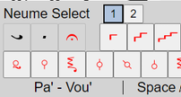

The highlighted component shows where the next gorgon, fthora, or accidental will be placed.

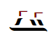

## Insert martyriæ and tempo

Use the martyria control in the main toolbar to insert a martyria. Its note and scale are calculated from the initial martyria and preceding fthoræ. To set a specific result, select the martyria, open `View > Properties`, turn off `Auto`, then choose the note or scale.

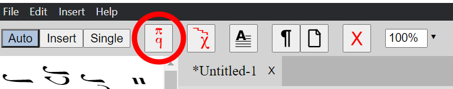

For example, a hymn may end on Di while the next hymn begins on Pa. In that case, you can override the final martyria so that it displays Pa even though the preceding melody ends on Di.

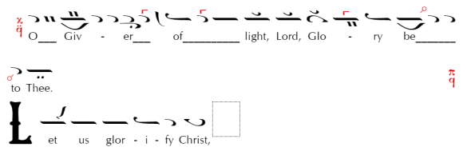

Use the main-toolbar tempo control to insert a tempo sign. A selected tempo sign has a BPM setting in Properties; newly inserted signs use the relevant default from Preferences when one is configured.

Click and hold the tempo control to choose from the available signs.

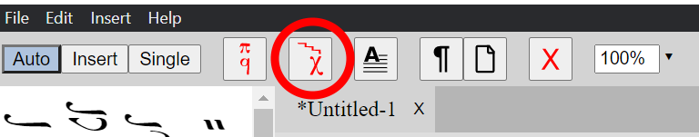

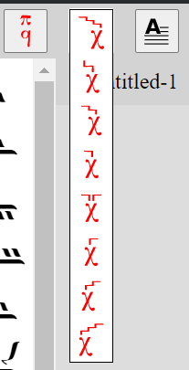

## Add barlines

Hold the barline control in the selected-neume toolbar and choose a long or short barline. Short barlines are positioned above a multi-neume group or martyria. For a break-safe result, apply a barline to the left of the neume it precedes; a martyria's barline can be applied at its top or right.

## Control line and page breaks

Select the element after which a break should occur, then use the main-toolbar Line Break or Page Break control. Use the same control again on the selected element to remove the break.

To prevent an automatic break between two notes, select the first note and enable `Keep with Next` in `View > Properties`. It cannot override a forced line or page break, and has no effect where the layout has no optional break.

If another condition makes `Keep with Next` unavailable, the switch is disabled but its value is retained. It becomes active again when the forced break or other conflict is removed.

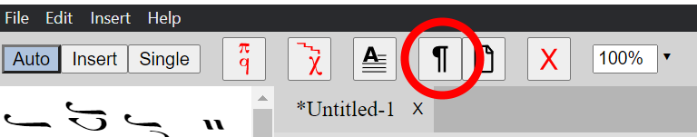

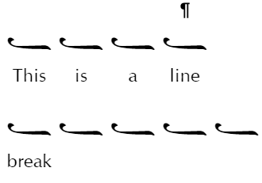

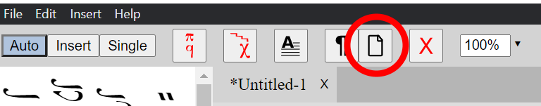

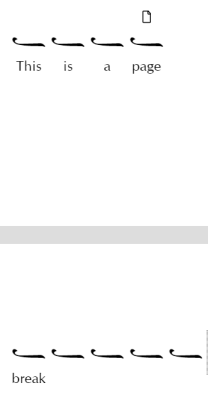

## Fine-tune positions

Most spacing should be handled automatically. If two supporting signs still collide, double-click the neume, right-click it and choose `Positioning`, or select it and use the positioning control in its toolbar.

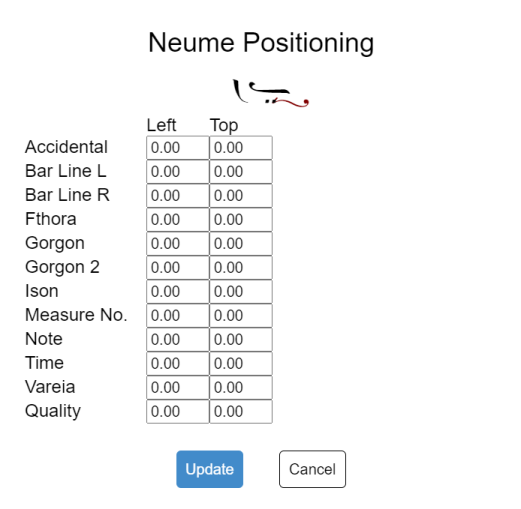

Drag a blue handle to move a sign, or edit its `Left` and `Top` values:

- Decrease `Left` to move left; increase it to move right.
- Decrease `Top` to move up; increase it to move down.

The adjustment applies only to the selected neume. This makes it useful for an isolated collision, but page spacing or line-breaking settings are usually better for a problem that occurs throughout the score.

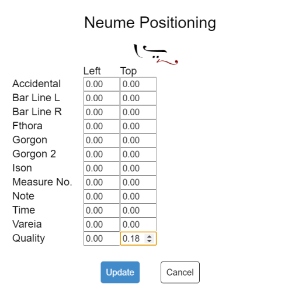
