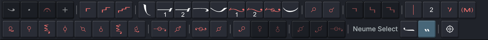

<!-- markdownlint-disable MD041 -->

# Writing Music

This chapter follows the everyday process of building a musical passage: enter quantitative neumes, add supporting signs, mark its musical structure, and control where it breaks across lines and pages. If Auto, Insert, and Single are unfamiliar, begin with [Getting Around and Editing a Score](/guide/editor-basics.html#choose-how-new-music-is-entered).

## Enter a passage

Leave **Auto** active when entering a new passage. Choose a quantitative neume in the Neume Selector, and Neanes advances to the next position. Continue choosing neumes to build the melody from left to right.

The outlined neume is both the current selection and the entry position. If Neanes replaces or inserts music somewhere unexpected, undo the edit and check the selection and entry mode before continuing.

As an alternative to clicking the Neume Selector, you may use the shortcuts in the [Neume Keyboard reference](/guide/keyboard.html).

## Add supporting signs

Select a quantitative neume to show its toolbar along the bottom of the editor. This toolbar contains the signs and settings that belong to that neume, including time signs, gorgons, vocal-expression signs, accidentals, fthoræ, barlines, measure numbers, note indicators, and ison indicators.

Hover over a control to see the sign's name and, when available, its keyboard shortcut. Choose a control to apply its sign to the selected neume.

Some controls provide a family of related signs. By default, press and hold the control, move to the desired sign, and release. To open these menus with a click instead, choose `Edit > Preferences` and change **Menu Interaction** to **Click to open menu**.

Supporting signs do not follow Auto, Insert, or Single. They always change the selected neume and leave the selection in place.

Neanes also uses attached fthoræ when calculating the scale of subsequent notes and automatic martyriæ. They therefore affect more than the appearance of the selected neume.

For most supporting signs:

- Choose the applied sign again to remove it.
- Choose a different sign in the same category to replace it.
- Use **Undo** if the result is not what you intended.

A disabled control means that the selected quantitative neume cannot accept that sign in the current position.

### Target part of a compound neume

Some quantitative neumes contain two or three components that can carry separate gorgons, fthoræ, or accidentals. When such a neume is selected, **Neume Select** appears at the end of the bottom toolbar.

Choose the button showing the component you want to target, then add the supporting sign. The highlighted component is the target for the next applicable gorgon, fthora, or accidental. Choose another component before applying a sign that belongs elsewhere in the same neume.

  <figure>
    
    <figcaption><strong>Choose a component.</strong> The highlighted button is the current target.</figcaption>
  </figure>

If a sign appears on the wrong component, undo it, choose the intended component under **Neume Select**, and apply the sign again.

## Mark musical structure

### Insert another initial martyria

A score can contain more than the initial martyria created with a new score. Use another standard initial martyria when a later hymn or section begins in a new mode:

1. Select the element that should follow the new initial martyria.
2. Choose `Insert > Initial Martyria`.
3. In the Initial Martyria dialog, choose a mode on the left and one of its supplied martyriæ on the right.

Neanes inserts the initial martyria before the selected element and uses it to establish the note and scale for the music that follows. To change it later, double-click it, right-click it and choose `Change Initial Martyria`, or use **Change Initial Martyria** in its bottom toolbar.

The dialog chooses _what_ the initial martyria says: the mode, starting note, and any fthora. _How_ it is written, such as the language, whether the mode is given as text or as a sign, and the font and color, is controlled by an initial martyria style. See [Choosing a style](#choosing-a-style) below.

While the initial martyria is selected, the toolbar at the bottom of the screen provides quick controls: the style, the size, the alignment, and tempo signs.

The Properties pane contains the full initial martyria settings, grouped into sections.

- `Style`: the `Style` select, a `Manage styles...` button that opens the styles dialog, and `Size`, `Color`, and `Outline` overrides. Each override has a clear button that returns the field to the value from the style. The button next to `Manage styles...` clears all three at once.
- `Positioning`: the `Inline` switch, alignment, `BPM`, and the top and bottom margins.
- `Initial Martyria`: `Show Ambitus`, `Ignore Attractions`, and `Permanent Enharmonic Zo`.

#### Choosing a style

Every initial martyria in a score is written according to a style. Built-in styles exist for Greek, English, Spanish, Church Slavonic, Russian, Arabic, Romanian, and Indonesian. For example, the Greek `Traditional sign` style writes the mode with the traditional sign, while the English `Mode names` style writes it in words.

To choose the style for the whole document, open `Format -> Initial Martyria Styles...`, select a style, and press `Use for this document`. You can also press `Manage styles...` in the Properties pane while an initial martyria is selected.

To give a single initial martyria a different style, select it and choose the style from the `Style` select in the Properties pane or in the toolbar at the bottom of the screen. `Document default` follows the style chosen for the document.

To create your own style, or to change the wording or typography of a built-in one, see [Initial Martyria Styles](./advanced.md#initial-martyria-styles) in the advanced guide. For initial martyriæ that no style can express, see [Custom Initial Martyriæ](./advanced.md#create-a-custom-initial-martyria).

> [!NOTE]
> Scores saved by earlier versions of Neanes are converted when opened. Their initial martyriæ use the Greek `Traditional sign` style, the old initial martyria settings from Page Setup become the `Initial Martyria` paragraph style, and any per-element color, size, or outline become overrides on that element.

#### Inline initial martyriæ

By default, an initial martyria occupies its own line. To place it in the line of neumes instead, for example before a short hymn or between two hymns on the same line, select the initial martyria and turn on the `Inline` switch in the `Positioning` section of the Properties pane. An inline initial martyria has no alignment or margins of its own, since it flows with the neumes around it.

#### Show the ambitus

The ambitus displays the lowest and highest notes of the passage governed by an initial martyria. Select the initial martyria, open `View > Properties`, and enable **Show Ambitus** under **Initial Martyria**. You can also right-click the initial martyria and enable **Show Ambitus**.

Neanes calculates the range from the notes after that initial martyria up to the next initial martyria, another element that changes the mode, or the end of the score.

### Insert a martyria

Select the element that should precede the martyria, then choose **Martyria**  in the main toolbar. The active entry mode controls whether Neanes advances and replaces the next element, inserts a new martyria, or changes only the selected element.

With **Auto** enabled, Neanes sets the martyria's note and scale from the initial martyria, the preceding melody, and any fthoræ. This usually gives the appropriate martyria for the music that came before it.

If the calculated note falls outside the range supported by Neanes, the martyria displays a question mark (`?`). Check the preceding melody and fthoræ, or turn off **Auto** and choose the martyria's **Note** and **Scale** manually.

Choose the martyria manually when it needs to introduce what follows instead. For example, if one hymn ends on Di and the next hymn begins on Pa, the martyria between them may need to show Pa rather than the final note of the preceding hymn. A manual choice can also be useful for a scale such as Spathi, whose martyria is not well defined within the tradition.

Select the martyria and open `View > Properties`. Turn off **Auto**, then choose its **Note** and **Scale**. Use **Martyria Sign Override** when the displayed martyria sign itself needs a different form.

The bottom toolbar for a selected martyria also lets you add a fthora, barline, or tempo sign. These signs belong to that martyria rather than becoming separate score elements.

To end a line with the martyria against the right margin, select it and choose **Align Right** <PhAlignRight class="guide-action-icon" weight="duotone" aria-hidden="true" /> in its bottom toolbar. You can also right-click the martyria and enable **Align Right**. Neanes moves the martyria to the right edge and begins the following material on a new line.

When **Align Right** is enabled, a **Neume** &#xe082; control appears in the martyria's bottom toolbar. Use this control to add a quantitative neume directly to the right of the martyria. The added neume belongs to the martyria; it is not the same as choosing a quantitative neume in the Neume Selector, which enters a separate score element according to the active entry mode.

### Add a tempo sign

Choose **Tempo Sign**  in the main toolbar to insert a separate tempo sign. Open its menu to choose from the available signs.

Select a tempo sign and set its **BPM** in Properties when the playback speed should differ from its default. You can set the defaults for each tempo sign under `Edit > Preferences`.

To attach a tempo sign to a martyria instead, select the martyria and use its bottom toolbar. A martyria can carry a tempo sign to its left, above it, or to its right.

### Add barlines and measure numbers

Select a quantitative neume or martyria, then use the barline control in its bottom toolbar. Open the control's menu to choose a long, short, double, or theseos barline.

Choosing the same barline repeatedly cycles it through the left side, right side, both sides, and then removes it. For a barline that must stay before a particular element when the score reflows, attach it to the left side of that element.

Short barlines appear above a multi-neume group or martyria. On a selected quantitative neume, the neighboring **Measure Number** control adds a number above the music; choose the same number again to remove it.

## Control line and page breaks

Neanes normally chooses line and page breaks automatically. Add a forced break only when the musical or textual structure requires one at a specific place.

Select the element after which the break should occur, then choose one of these controls in the main toolbar:

- **Line Break** <PhParagraph class="guide-action-icon" weight="duotone" aria-hidden="true" /> starts the next element on a new line.
- **Centered Line Break** <svg class="guide-action-icon" viewBox="0 0 24 24" width="1em" height="1em" aria-hidden="true"><PhParagraph size="24" weight="duotone" transform="matrix(0.75 0 0 1 -2 0)" /><PhTextAlignCenter size="12" x="12" y="12" /></svg> centers the current line and starts the next element on a new line.
- **Page Break** <PhFile class="guide-action-icon" aria-hidden="true" /> starts the next element on a new page.

Choose the active break control again to remove the break. Choosing a different break type replaces the existing one. A marker above the selected element shows where the forced break is attached.

To discourage an automatic line break without forcing the next element onto a particular line, select the first of the two elements and enable **Keep with Next** in Properties. It cannot override a forced line or page break.

::: tip Prefer automatic layout
Forced breaks are useful for meaningful phrase boundaries and deliberate page turns. If many lines need manual breaks, adjust the spacing and line-width settings in [Page Layout and Books](/guide/page-layout.html) before placing more of them.
:::

## Adjust horizontal spacing

Use **Space After** when a note, martyria, or separate tempo sign needs a small one-off horizontal correction. Select the element, open `View > Properties`, expand **Positioning**, and change **Space After**:

- A positive value adds space before the next element.
- A negative value pulls the next element closer.

The value is measured in points and participates in line layout, so check the surrounding line after making a large adjustment. For spacing problems that repeat throughout the score, change the spacing settings in [Page Layout and Books](/guide/page-layout.html) instead.

## Fine-tune positions

Neanes positions supporting signs automatically. If one neume still has a collision, double-click it, right-click it and choose `Positioning`, or select it and choose **Positioning** <PhCrosshair class="guide-action-icon" aria-hidden="true" /> in the bottom toolbar.

Choose the affected sign, then drag its blue handle or edit its **Left** and **Top** values:

- Decrease **Left** to move the sign left; increase it to move right.
- Decrease **Top** to move the sign up; increase it to move down.

The adjustment applies only to the selected neume. Use it for an isolated problem, not to correct spacing throughout the score. For repeated problems, change Page Setup or allow the automatic line breaking to reflow the passage.

## Next steps

Learn how to [enter and manage lyrics](/guide/lyrics.html), or consult the [Neume Keyboard reference](/guide/keyboard.html) for an alternative way to enter music.
